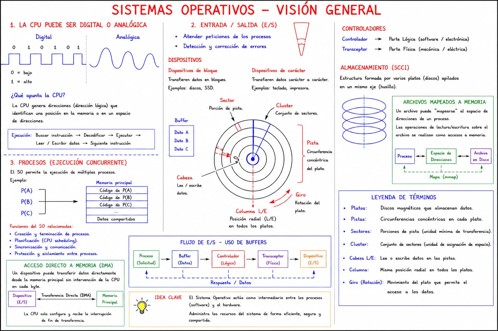
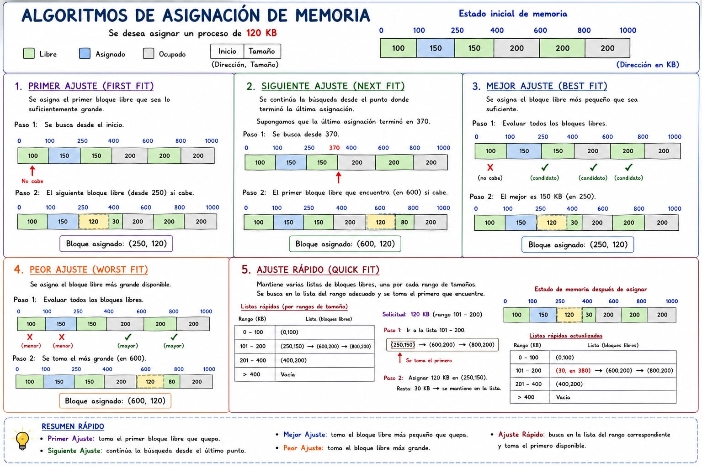
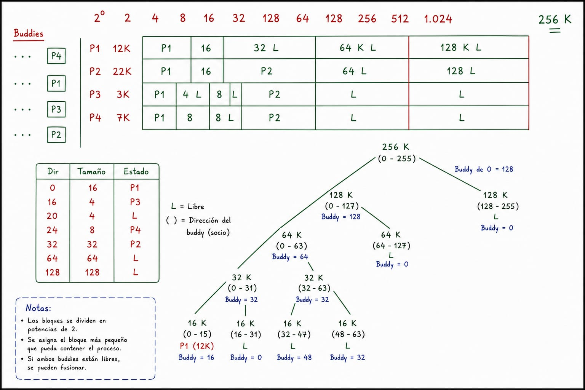

# Materia de Sistemas Operativos — explicación estilo Calidad

> [!abstract] Idea madre del curso
> Sistemas Operativos no se estudia como una lista de definiciones. Se estudia como una cadena de decisiones. Cada vez que aparece un proceso, una variable, un archivo, un sensor, un disco, una red o un recurso compartido, hay que preguntarse: **qué dato entra, qué recurso presiona, qué cola se satura, qué política conviene y qué pasa si me equivoco**.

Esta nota está escrita para estudiar la materia como se razona en clase: no basta decir “usa buffer”, “usa Round Robin”, “usa paginación” o “hay bloqueo”. Hay que defender por qué. Hay que llevar la respuesta desde el caso concreto hasta la política del sistema operativo.

---

# Índice

- [[#0. Cómo se debe responder en este curso]]
- [[#1. Capítulo 1 — Qué es un sistema operativo]]
- [[#2. Capítulo 2 — Procesos, CPU, estados y planificación]]
- [[#3. Capítulo 3 — Administración de memoria]]
- [[#4. Capítulo 4 — Sistemas de archivos]]
- [[#5. Capítulo 5 — Entrada y salida]]
- [[#6. Capítulo 6 — Bloqueos e interbloqueos]]
- [[#7. Capítulo 8 — Multiprocesadores, sistemas distribuidos y arquitectura paralela]]
- [[#8. Linux como referencia práctica]]
- [[#9. Cómo analizar casos de examen]]
- [[#10. Errores típicos que bajan puntos]]
- [[#11. Resumen final de decisión rápida]]
- [[Tablero_SO_Calidad|Tablero de estudio Make.md]]
- [[Mapa_Final_SO_Calidad.excalidraw|Mapa Excalidraw]]

---

# 0. Cómo se debe responder en este curso

## 0.1 La diferencia entre definición y razonamiento

Una respuesta floja dice:

> “El proceso usa memoria porque necesita guardar datos.”

Una respuesta fuerte dice:

> “El proceso recibe datos desde un dispositivo, por ejemplo un sensor, una cámara, una tarjeta de red o un disco. Ese dato no se puede asumir como procesado; primero llega en crudo. Por tanto, el sistema operativo debe ubicarlo temporalmente en un buffer del dispositivo o del subsistema de E/S. Luego, cuando se valida que el dato llegó íntegro, se copia al bloque de memoria del proceso. Si el proceso reutiliza frecuentemente ese dato o una parte de él, ahí sí podría justificarse cache. Si solo se recibe, se acumula y se consume una vez, lo correcto es hablar de buffer, no de cache.”

La segunda respuesta es la que interesa porque conecta: **dispositivo → dato de origen → buffer → memoria del proceso → consumo → posible cache**.

## 0.2 La plantilla universal de Calidad

Cada vez que aparezca un caso con procesos, sensores, archivos o recursos, se analiza con esta ruta:

| Pregunta | Qué se está buscando | Cómo se defiende |
|---|---|---|
| ¿Cuál es el dato de origen? | Qué entrega el dispositivo antes de procesarlo | “No analizo el resultado final, analizo lo que entra en crudo.” |
| ¿Quién produce el dato? | Sensor, disco, red, cámara, usuario, otro proceso | Permite saber si hay E/S, buffer, driver o interrupción. |
| ¿El proceso lee, escribe o ambas? | Riesgo de sección crítica y tipo de operación de archivo | Leer no rompe integridad; escribir sí puede generar conflicto. |
| ¿Es tiempo real? | Si llegar tarde vuelve inútil el resultado | Si la alerta llega tarde, el sistema falló aunque haya calculado bien. |
| ¿Consume CPU o espera E/S? | Algoritmo de planificación | CPU intenso no se trata igual que E/S intenso. |
| ¿Cuánta memoria necesita? | Particiones, paginación, swap, reemplazo | Imagen, audio, IA y tablas grandes presionan memoria. |
| ¿Crece en memoria? | Reasignación, protección, fragmentación, swap | Si el proceso crece, el bloque original puede no bastar. |
| ¿Reutiliza datos? | Cache | Cache se justifica por frecuencia de reutilización. |
| ¿Acumula datos temporalmente? | Buffer | Buffer se justifica por diferencia entre producción y consumo. |
| ¿Comparte recursos? | Bloqueos | Si retiene algo mientras espera otra cosa, puede bloquear. |
| ¿Depende de otro proceso? | Espera circular, sincronización, IPC | Si A espera a B y B espera a A, hay problema. |

## 0.3 La frase que ordena casi todo

> [!tip] Frase guía
> “Primero identifico el dato y el recurso; después decido la política.”

No se empieza escogiendo algoritmo. Se empieza leyendo el comportamiento del proceso.

---

# 1. Capítulo 1 — Qué es un sistema operativo



## 1.1 El sistema operativo como intermediario

Una computadora real tiene CPU, memoria principal, discos, tarjetas de red, teclado, pantalla, buses, controladores, interrupciones y muchos detalles que un programador normal no quiere manipular directamente. El sistema operativo aparece para que el usuario y los programas no tengan que hablar con el hardware en su forma más cruda.

La idea central es:

> El sistema operativo convierte hardware complicado en abstracciones utilizables.

El disco real tiene sectores, pistas, cilindros, tiempos de búsqueda, latencia rotacional, errores y controladoras. Pero el usuario no quiere pensar en eso. El usuario quiere decir: “abra este archivo”, “guarde este documento”, “lea esta imagen”. Entonces el sistema operativo crea la abstracción **archivo**.

La memoria física es un conjunto de direcciones reales limitadas. Pero el proceso no quiere saber exactamente en qué chip está cada variable. Entonces el sistema operativo crea la abstracción **espacio de direcciones**.

La CPU es una sola o unas pocas unidades que ejecutan instrucciones. Pero el usuario siente que tiene muchas aplicaciones abiertas a la vez. Entonces el sistema operativo crea la abstracción **proceso**.

## 1.2 Sistema operativo como máquina extendida

Cuando se dice que el sistema operativo es una máquina extendida, se quiere decir que presenta una máquina más cómoda que la real.

La máquina real es incómoda:

- El disco no entiende “archivo bonito”; entiende bloques.
- La memoria no entiende “variable importante”; entiende direcciones.
- La CPU no entiende “aplicación”; entiende instrucciones.
- La tarjeta de red no entiende “mensaje completo”; entiende tramas o paquetes.
- La impresora no entiende “documento de Word”; recibe datos formateados para imprimir.

El sistema operativo es el que tapa esa fealdad y ofrece una interfaz más limpia.

En lenguaje de clase: uno no quiere estar diciéndole al disco “mueva la cabeza a tal pista, espere que pase tal sector, lea este bloque, ahora verifique error”. Uno quiere pedir el archivo. El sistema operativo hace la parte sucia.

## 1.3 Sistema operativo como administrador de recursos

La otra cara es que el sistema operativo administra recursos escasos:

- CPU.
- Memoria.
- Disco.
- Dispositivos de E/S.
- Archivos.
- Red.
- Impresora.
- Variables compartidas.
- Semáforos, mutexes y otros mecanismos de sincronización.

Si varios procesos quieren CPU, el sistema operativo decide quién entra a ejecución. Si varios procesos quieren memoria, decide cómo se asigna. Si varios procesos quieren escribir en el mismo archivo, debe proteger la integridad. Si varios procesos quieren la impresora, debe ordenar las solicitudes.

Esto introduce una idea clave:

> [!important] El sistema operativo no solo permite usar recursos; también evita que el uso de un proceso destruya el trabajo de otro.

## 1.4 Multiplexación en tiempo y en espacio

El sistema operativo comparte recursos de dos formas.

### Multiplexación en tiempo

Un recurso lo usa un proceso por un rato y después otro. El ejemplo clásico es la CPU. Si hay una sola CPU y cinco procesos, no pueden ejecutar literalmente al mismo tiempo en esa CPU. Entonces se turnan.

El sistema operativo decide:

- Quién entra.
- Por cuánto tiempo.
- Qué pasa si se bloquea.
- Qué pasa si se acaba el quantum.
- Qué pasa si llega un proceso más importante.

### Multiplexación en espacio

Un recurso se divide en partes. La memoria es el ejemplo principal. Varios procesos pueden tener bloques de memoria asignados simultáneamente.

El disco también se multiplexa en espacio: varios usuarios y procesos tienen archivos en el mismo disco.

## 1.5 Modo kernel y modo usuario

El sistema operativo ejecuta partes privilegiadas en modo kernel. Las aplicaciones normales ejecutan en modo usuario.

La diferencia es importante:

| Modo | Qué puede hacer | Riesgo |
|---|---|---|
| Usuario | Ejecutar programa normal, pedir servicios | No debe tocar hardware directamente |
| Kernel | Controlar hardware, memoria, interrupciones, dispositivos | Si falla, puede caer todo el sistema |

Una aplicación no debe poder escribir directamente sobre cualquier sector del disco ni sobre cualquier dirección de memoria. Si pudiera hacerlo, destruiría archivos, memoria de otros procesos o incluso el kernel.

Por eso se usan **llamadas al sistema**.

## 1.6 Llamadas al sistema

Una llamada al sistema es la forma controlada en que un programa de usuario le pide algo al sistema operativo.

Ejemplos:

- Crear un proceso.
- Terminar un proceso.
- Abrir un archivo.
- Leer un archivo.
- Escribir un archivo.
- Reservar memoria.
- Enviar datos por red.
- Esperar a que termine un hijo.

En estilo Calidad: el proceso no se manda solo sobre el hardware. El proceso solicita. El sistema operativo valida, administra y ejecuta la operación segura.

## 1.7 Abstracciones principales del curso

El curso gira alrededor de estas abstracciones:

| Abstracción | Recurso real que oculta | Capítulo fuerte |
|---|---|---|
| Proceso | CPU e instrucciones en ejecución | CPU / procesos |
| Espacio de direcciones | Memoria física limitada | Memoria |
| Archivo | Bloques físicos de disco | Archivos |
| Dispositivo de E/S | Controladora, registros, interrupciones | Entrada/salida |
| Recurso compartido | Variables, dispositivos, archivos, semáforos | Bloqueos |
| Nodo distribuido | CPU/memoria/disco en otra máquina | Distribuidos |

---

# 2. Capítulo 2 — Procesos, CPU, estados y planificación

## 2.1 Qué es un proceso

Un proceso no es simplemente “un programa”. Un programa puede estar guardado en disco sin ejecutarse. Un proceso es ese programa cuando ya está dentro del ciclo de ejecución.

> [!definition] Proceso
> Un proceso es una pila de código en ejecución, acompañada de su contexto: contador de programa, registros, memoria asignada, archivos abiertos, estado, recursos y demás información que el sistema operativo necesita para administrarlo.

En lenguaje de clase: un proceso es una pila de código que ya entró al ciclo. Si la tarea solo existe como archivo en disco, todavía no es proceso. Se vuelve proceso cuando el sistema operativo la carga, le asigna contexto y la mete a competir por CPU.

## 2.2 Pila de código y traducción a instrucciones

Cuando uno escribe un programa de 1000 líneas en Python, Java, C o cualquier lenguaje, eso no significa que la CPU vea 1000 instrucciones. El código fuente se traduce, se expande, incluye librerías, se convierte a instrucciones más básicas y puede terminar como decenas de miles de instrucciones de máquina.

La idea importante es:

> El tamaño de la pila de código que entiende la CPU puede ser muchísimo mayor que el código fuente que escribió el programador.

Por eso, cuando se habla de ráfaga de CPU, no se piensa en “cuántas líneas escribió el estudiante”, sino en cuánto trabajo real tiene que ejecutar el procesador.

## 2.3 Estados de un proceso

El modelo base usa estos estados:

- Nuevo.
- Listo.
- En ejecución.
- Espera por entrada/salida.
- Terminado.

En la lógica de clase, los estados más importantes para examen son:

- **Listo**: el proceso ya puede ejecutar, pero está esperando CPU.
- **Ejecución**: el proceso está usando CPU.
- **Espera por E/S**: el proceso no puede avanzar porque necesita un dato, dispositivo, archivo, red, impresión, etc.

## 2.4 Transiciones importantes

### De listo a ejecución

Ocurre cuando el planificador de corto plazo selecciona el proceso.

La pregunta aquí es: ¿por qué ese proceso y no otro?

Respuesta: depende del algoritmo de planificación.

### De ejecución a listo

Este punto es delicado. En la lógica vista en clase, un proceso vuelve de ejecución a listo principalmente cuando se usa **Round Robin** y se le acaba el quantum, pero todavía tiene instrucciones para seguir.

> [!warning] Error típico
> No diga que un proceso vuelve a listo “porque sí”. Si estaba ejecutando y pasa a listo, explique qué lo sacó: normalmente fin de quantum en Round Robin.

### De ejecución a espera por E/S

Ocurre cuando el proceso encuentra una instrucción que requiere entrada/salida.

Ejemplo: estaba ejecutando instrucciones, pero llega un punto donde necesita leer de disco, recibir de red, consultar sensor, imprimir o esperar una respuesta de dispositivo. Como CPU no puede producir ese dato, el proceso se bloquea y pasa a espera por E/S.

### De espera por E/S a listo

Ocurre cuando el dispositivo termina la solicitud. El dato ya fue colocado donde corresponde, normalmente luego de pasar por buffer y validación. Entonces el proceso queda listo para volver a CPU.

## 2.5 Planificador de largo plazo y corto plazo

### Planificador de largo plazo

Decide qué procesos entran al sistema. Controla el grado de multiprogramación.

Si deja entrar demasiados procesos, se saturan memoria, colas y dispositivos. Si deja entrar muy pocos, se desperdician recursos.

### Planificador de corto plazo

Decide cuál proceso de la cola de listos entra a CPU.

Este es el que se relaciona directamente con los algoritmos de planificación:

- FCFS.
- SJF.
- Round Robin.
- Prioridades.
- Tiempo real.

## 2.6 Criterios de planificación de CPU

En clase se manejan criterios como:

- Eficacia.
- Eficiencia.
- Rendimiento.
- Tiempo de respuesta.
- Tiempo de espera.

### Eficacia

La eficacia busca que todos los procesos logren avanzar y terminar. No sirve un sistema que atiende muy bien a dos procesos, pero deja colgados permanentemente a los demás.

En lenguaje de examen: si una política discrimina procesos al punto de que algunos nunca ejecutan, puede tener buen rendimiento parcial, pero mala eficacia.

### Eficiencia

La eficiencia se relaciona con uso balanceado de recursos. No se quiere CPU saturado y E/S vacía, ni E/S saturada y CPU ociosa.

La idea de Calidad es mirar las colas:

- Si la cola de listos está gigante, hay mucha presión de CPU.
- Si la cola de E/S está gigante, los dispositivos están siendo cuello de botella.
- Si una cola está vacía siempre, ese recurso puede estar subutilizado.

### Rendimiento

El rendimiento se asocia al aprovechamiento de CPU: cuánto tiempo la CPU pasa haciendo trabajo útil.

El sueño es CPU ocupada casi siempre. Pero si los procesos encuentran E/S muy pronto, se van a espera y la CPU puede quedar sin trabajo si no hay suficientes procesos listos.

### Tiempo de respuesta

Es el tiempo desde que el proceso entra hasta que recibe respuesta o termina.

Ejemplo de banco: desde que la persona entra al banco hasta que sale. Incluye espera, cola, atención y finalización.

En sistemas interactivos, el tiempo de respuesta importa muchísimo porque el usuario percibe lentitud.

### Tiempo de espera

Es el tiempo que el proceso pasa esperando en colas, especialmente en la cola de listos.

Un proceso puede tener poca ráfaga, pero mucho tiempo de espera si la política lo relega.

## 2.7 Ráfaga de CPU

La ráfaga es el tramo en que el proceso usa CPU antes de bloquearse, terminar o ser desalojado.

Procesos con ráfaga alta:

- Análisis de imágenes.
- IA.
- Compresión de video.
- Cálculo científico.
- Búsqueda masiva de patrones.
- Criptografía.

Procesos con ráfaga baja:

- Lectura simple de sensor.
- Registro de un dato escalar.
- Validación sencilla.
- Activar una alarma.

Pero hay que tener cuidado: un proceso puede recibir datos simples y aun así tener cálculo pesado si hace análisis complejo sobre ellos.

Ejemplo: un sensor de temperatura entrega un número real. Eso es simple. Pero si un proceso toma millones de lecturas históricas para predecir una falla usando IA, ya no es simple.

## 2.8 Procesos CPU-bound e I/O-bound

### CPU-bound

Un proceso CPU-bound consume mucha CPU y se bloquea poco por E/S.

Ejemplo: cálculo matemático largo, simulación, análisis de ADN, entrenamiento de modelo, compresión.

### I/O-bound

Un proceso I/O-bound pasa mucho tiempo esperando datos de dispositivos.

Ejemplo: lectura de sensores, transferencia de red, consulta de disco, impresión, captura de audio/video.

### Por qué importa

Porque el planificador debe balancear. Si mete solo CPU-bound, puede saturar CPU y dejar dispositivos quietos. Si mete solo I/O-bound, los procesos se bloquean rápido y CPU puede quedar subutilizada.

## 2.9 Algoritmos de planificación

## 2.9.1 FCFS — First Come, First Served

Atiende en orden de llegada.

Ventajas:

- Simple.
- Bajo costo administrativo.
- Fácil de justificar si todos los procesos son parecidos.

Desventajas:

- Puede generar efecto convoy.
- Un proceso largo puede atrasar muchos cortos.
- Malo para sistemas interactivos si hay procesos muy pesados adelante.

En lenguaje Calidad:

> Si el primero que llegó trae una ráfaga enorme, todos los demás quedan detrás aunque algunos se resolvieran rápido. Entonces la cola se ve justa por orden, pero injusta por comportamiento.

## 2.9.2 SJF — Shortest Job First

Atiende primero el trabajo más corto.

Ventajas:

- Reduce tiempo promedio de espera si se conoce la duración.
- Bueno cuando se pueden estimar ráfagas.

Desventajas:

- Requiere estimar duración.
- Puede provocar inanición de procesos largos.
- No siempre sirve para tiempo real.

En examen se defiende si el caso permite estimar que ciertos procesos son claramente cortos y otros largos.

## 2.9.3 Round Robin

Cada proceso recibe una porción fija de CPU llamada quantum. Si no termina, vuelve a la cola de listos.

Ventajas:

- Bueno para sistemas interactivos.
- Da sensación de reparto justo.
- Evita que uno solo monopolice CPU.

Desventajas:

- Si el quantum es muy pequeño, hay demasiado cambio de contexto.
- Si el quantum es muy grande, se parece a FCFS.
- Puede ser problemático con operaciones que necesitan terminar de forma atómica.

### Round Robin y commit

Este fue un punto importante: si un proceso está haciendo una operación tipo commit, transacción o actualización que debe terminar completa, interrumpirlo puede ser peligroso.

No porque Round Robin “borre” mágicamente todo, sino porque puede dejar una operación a medio camino si no está protegida por mecanismos transaccionales. Si el proceso estaba escribiendo resultados que deben quedar consistentes, cortar sin control puede obligar rollback o generar inconsistencias.

Por eso, en lenguaje de examen:

> Round Robin es bueno para repartir CPU, pero si el caso involucra secciones críticas, commits, escritura compartida o actualización atómica, debo explicar cómo se protege esa interrupción. No basta decir “aplico Round Robin”.

## 2.9.4 Prioridades

Cada proceso tiene una prioridad y se atienden los más importantes primero.

Ventajas:

- Permite privilegiar alarmas, control médico, seguridad, actuadores.
- Útil cuando no todos los procesos tienen el mismo impacto.

Desventajas:

- Puede generar inanición.
- Requiere política clara de asignación de prioridad.
- Puede necesitar envejecimiento para subir procesos que llevan mucho esperando.

Ejemplo Calidad: si un proceso detecta una anomalía crítica en leche, oxígeno, frecuencia cardíaca o control de acceso peligroso, puede tener prioridad mayor que un proceso de reporte histórico.

## 2.9.5 Planificación de tiempo real

Un proceso de tiempo real no se define solo porque sea “rápido”. Se define porque tiene una restricción temporal: si llega tarde, el resultado pierde valor o genera daño.

Ejemplos:

- Alarma médica.
- Control de frenos.
- Monitoreo de oxígeno.
- Control de aguja o actuador en una máquina.
- Detección de intrusión.
- Retiro automático de chuponeras si se seca la ubre.

No todo sensor es tiempo real. Un sensor de temperatura que registra datos históricos puede no ser tiempo real. Pero si controla una alarma de sobrecalentamiento, sí puede serlo.

## 2.10 Cambio de contexto

Cambio de contexto es guardar el estado de un proceso y cargar el estado de otro.

Incluye:

- Contador de programa.
- Registros.
- Estado.
- Información de memoria.
- Recursos asociados.

Tiene costo. Durante el cambio de contexto, la CPU no está ejecutando trabajo útil del proceso.

Por eso un quantum demasiado pequeño puede matar el rendimiento: el sistema pasa más tiempo cambiando que ejecutando.

## 2.11 Variables compartidas y secciones críticas

Si dos procesos leen la misma variable, normalmente no hay conflicto.

Si uno o ambos escriben, aparece riesgo.

Una sección crítica es una parte del código donde se accede a un recurso compartido que debe protegerse.

Ejemplo:

- Proceso A lee saldo.
- Proceso B lee el mismo saldo.
- A escribe nuevo saldo.
- B escribe otro nuevo saldo calculado con valor viejo.

Resultado: inconsistencia.

En examen, si el proceso escribe archivos, variables compartidas, registros de base de datos o estados de actuadores, hay que valorar sección crítica.

## 2.12 IPC — Comunicación entre procesos

Los procesos pueden necesitar comunicarse. Pueden hacerlo mediante:

- Memoria compartida.
- Mensajes.
- Pipes.
- Sockets.
- Archivos temporales.
- Señales.
- Semáforos.
- Monitores.

El punto de examen no suele ser listar mecanismos, sino reconocer cuándo hay dependencia.

Si un proceso produce datos que otro necesita, hay comunicación. Si además comparten el recurso donde se escribe ese dato, puede haber sincronización y bloqueo.

---

# 3. Capítulo 3 — Administración de memoria





## 3.1 La memoria como locker

La analogía fuerte de clase es imaginar la memoria como lockers. Cada proceso necesita un espacio para guardar sus cosas: instrucciones, variables, datos, resultados parciales, tablas, punteros y estructuras.

Un proceso no ejecuta en el aire. Necesita memoria.

La CPU ejecuta instrucciones, pero esas instrucciones y los datos que manipula deben estar disponibles en memoria principal. Si no están, el proceso no puede avanzar hasta que se traigan.

## 3.2 Monoprogramación

En monoprogramación, la memoria se divide de forma simple:

- Sistema operativo.
- Programa de usuario.
- Quizá rutinas básicas o ROM/BIOS en el arranque.

Solo un programa de usuario ejecuta a la vez. Es simple, pero desperdicia capacidad porque si ese programa espera E/S, la CPU puede quedar sin hacer trabajo útil.

## 3.3 Multiprogramación

Con multiprogramación, la memoria se parte para tener varios procesos residentes.

Ventaja:

- Si un proceso se bloquea por E/S, otro puede usar CPU.
- Se mejora aprovechamiento.
- Se mantienen varias colas activas.

Pero aparece el problema central:

> ¿Cómo divido memoria y cómo decido dónde meto cada proceso?

## 3.4 Particiones fijas del mismo tamaño

La memoria se divide en bloques iguales.

Ventaja:

- Administración muy barata.
- Rápido decidir dónde meter un proceso.
- No requiere cálculos complejos.

Desventaja:

- Desperdicio interno alto.
- El tamaño del bloque se define pensando en procesos grandes.
- Procesos pequeños desperdician gran parte del bloque.
- Un proceso más grande que el bloque no puede ejecutarse.

Ejemplo:

Si todos los bloques son de 200 KB:

- Proceso de 190 KB: desperdicia 10 KB.
- Proceso de 80 KB: desperdicia 120 KB.
- Proceso de 300 KB: no cabe.

La desventaja más fuerte no es solo “desperdicio”; es que un proceso que nunca se había ejecutado y necesita más del máximo previsto queda colgado. Puede no entrar al ciclo porque no hay bloque capaz de contenerlo.

## 3.5 Particiones fijas de varios tamaños

La memoria se divide en bloques fijos, pero de tamaños diferentes.

Ejemplo:

- Bloques pequeños.
- Bloques medianos.
- Bloques grandes.

Esto reduce desperdicio porque un proceso pequeño puede ir a un bloque pequeño.

Pero crea nuevas preguntas:

- ¿A qué cola entra el proceso?
- ¿Qué pasa si la cola de bloques pequeños se satura?
- ¿Qué pasa si los bloques grandes quedan subutilizados?
- ¿Qué pasa si el proceso crece?

## 3.6 Desperdicio interno y externo

### Desperdicio interno

Espacio que sobra dentro de un bloque asignado.

Ejemplo: bloque de 200 KB, proceso de 70 KB. Sobran 130 KB dentro del bloque, pero no los puede usar otro proceso.

### Desperdicio externo

Espacio libre que existe fuera de bloques asignados, pero fragmentado o no utilizable para una solicitud concreta.

Ejemplo: hay 100 KB libres en total, pero repartidos en huecos de 10 KB. Si un proceso pide 50 KB continuos, no cabe.

## 3.7 Crecimiento de procesos

Un proceso puede crecer porque:

- Carga más datos.
- Abre estructuras nuevas.
- Recibe más registros.
- Amplía pila o heap.
- Procesa imágenes, audio o tablas grandes.
- Genera resultados intermedios.

Si el bloque original ya no alcanza, hay que resolver.

En particiones fijas de varios tamaños, una idea vista es **reasignación y protección**: buscar espacio adicional y protegerlo para que no choque con variables del otro proceso.

La palabra clave es atomicidad: reasignar y proteger deben tratarse como una operación coherente. Si se toma espacio de otro bloque sin proteger, pueden ocurrir conflictos de variables o corrupción.

## 3.8 Particiones variables

En particiones variables, la memoria no está partida rígidamente desde el inicio. Se asigna según lo que el proceso necesita.

Ventaja:

- Asignación más justa.
- Menos desperdicio interno.

Desventaja:

- Más costo administrativo.
- Fragmentación externa.
- Necesidad de algoritmos de búsqueda.
- Puede requerir compactación.

## 3.9 Mapa de bits

Un mapa de bits representa memoria como muchas unidades pequeñas. Cada bit indica si una unidad está libre u ocupada.

Ejemplo conceptual:

```text
1 1 1 0 0 1 0 0 0 1 1 0
```

Donde:

- 1 = ocupado.
- 0 = libre.

Si un proceso pide 4 unidades, el sistema debe buscar 4 ceros consecutivos.

### Ventajas

- Representación compacta.
- Fácil saber si una unidad está ocupada.

### Desventajas

- Buscar bloques consecutivos puede ser costoso.
- Si siempre se empieza desde el inicio, se trilla el arranque de memoria.
- Aparecen huecos inútiles al inicio.

## 3.10 Huecos inútiles y desfragmentación

Los huecos inútiles son espacios libres pequeños que no sirven para solicitudes reales.

Si el algoritmo siempre barre desde el inicio, el inicio de memoria se llena de pedacitos libres y ocupados. Entonces encontrar espacio contiguo se vuelve más difícil.

La solución conceptual es desfragmentar:

> Apagar el motor de asignación normal por un momento, mover lo ocupado hacia un lado y dejar el espacio libre junto.

Desfragmentar tiene costo. No es gratis. Mover procesos o bloques implica actualizar referencias y cuidar que ningún proceso use direcciones viejas.

## 3.11 Listas ligadas para memoria libre

En vez de representar cada unidad con un bit, se puede usar una lista de segmentos.

Cada nodo puede tener:

- Estado: libre u ocupado.
- Dirección inicial.
- Tamaño.
- Puntero al siguiente.

Ejemplo:

```text
[L, dir=0, tam=20] -> [P1, dir=20, tam=40] -> [L, dir=60, tam=15]
```

Esto permite recorrer segmentos en vez de cada unidad individual.

## 3.12 Primer ajuste

Primer ajuste busca desde el inicio y mete el proceso en el primer hueco donde quepa.

Ventaja:

- Rápido.
- No revisa toda la memoria si encuentra pronto.

Desventaja:

- Puede desperdiciar bloques grandes.
- Tiende a fragmentar el inicio.

Calidad diría: “donde primero cabe, ahí lo mete; pero eso no significa que sea el mejor lugar, solo fue el primero que alcanzó.”

## 3.13 Siguiente ajuste

Siguiente ajuste mejora primer ajuste dejando un puntero donde fue la última asignación. La siguiente búsqueda arranca desde ahí.

Ventaja:

- Evita trillar siempre el inicio.
- Reparte mejor el recorrido.

Desventaja:

- Puede saltarse huecos útiles.
- No garantiza menor desperdicio.

## 3.14 Mejor ajuste

Busca el hueco más ajustado para la solicitud.

Si pide 10 KB, idealmente usa un hueco de 10 KB; si no, uno de 11, 12, 13, etc.

Ventaja:

- Reduce desperdicio inmediato.

Desventaja:

- Debe recorrer mucho o toda la lista.
- Puede dejar huecos diminutos inútiles.

## 3.15 Peor ajuste

Usa el hueco más grande disponible.

La idea es que, al partir un hueco grande, todavía quede un hueco relativamente útil.

Ventaja:

- Evita crear huecos demasiado pequeños en algunos casos.

Desventaja:

- Consume los bloques grandes.
- Puede perjudicar procesos grandes futuros.

## 3.16 Ajuste rápido

Mantiene listas separadas por tamaños comunes.

Ejemplo:

- Lista de huecos de 4 KB.
- Lista de huecos de 8 KB.
- Lista de huecos de 16 KB.
- Lista de huecos de 32 KB.

Ventaja:

- Muy rápido si hay tamaños frecuentes.

Desventaja:

- Más estructura administrativa.
- Puede complicar coalescencia de huecos.
- Puede mantener listas con tamaños poco útiles.

## 3.16.1 Sistema de buddies o socios

El sistema de buddies es otra forma de administrar memoria libre. En vez de buscar cualquier hueco arbitrario, organiza la memoria como divisiones sucesivas en potencias de 2.

Si la memoria total es de 256 KB, puede dividirse en:

```text
256
├─ 128
│  ├─ 64
│  │  ├─ 32
│  │  │  ├─ 16
│  │  │  └─ 16
│  │  └─ 32
│  └─ 64
└─ 128
```

Cuando llega un proceso, se le asigna el bloque potencia de 2 más pequeño que pueda contenerlo.

| Solicitud | Bloque buddy | Desperdicio interno |
|---:|---:|---:|
| 3 KB | 4 KB | 1 KB |
| 7 KB | 8 KB | 1 KB |
| 12 KB | 16 KB | 4 KB |
| 22 KB | 32 KB | 10 KB |

La ventaja fuerte es la fusión. Si un bloque queda libre y su socio también está libre, ambos se unen y reconstruyen el bloque padre.

| Situación | Decisión |
|---|---|
| P1 libera 16 KB, pero su socio sigue ocupado | No se fusiona. |
| Dos bloques de 16 KB socios están libres | Se fusionan en 32 KB. |
| Dos bloques de 32 KB socios están libres | Se fusionan en 64 KB. |

> [!note] Relación con Tanenbaum y clase
> Tanenbaum presenta mapas de bits y listas ligadas como formas base de llevar memoria libre. La pizarra de clase agrega buddies como estrategia estructurada: no busca cualquier hueco, sino un bloque de una clase de tamaño que permita dividir y recomponer rápido.

En estilo Calidad, buddies se defiende así:

> “Acepto desperdicio interno por redondeo, pero gano una administración ordenada y rápida para dividir/fusionar. Lo usaría cuando el costo de buscar y compactar huecos arbitrarios pesa más que el desperdicio por potencia de 2.”

## 3.17 Cache en memoria

Cache no es “guardar cualquier cosa”. Cache es guardar de manera selectiva lo que se usa con frecuencia para evitar ir a buscarlo más lejos o recalcularlo.

Características:

- Es rápido.
- Es caro.
- Es selectivo.
- Requiere política de reemplazo.
- Se justifica por reutilización.

Ejemplo de clase: variables del bloque de control del proceso que se modifican frecuentemente. No se cachea todo el proceso; se cachea lo que se usa mucho.

## 3.18 Cache como imagen o complemento

Hay una discusión clave: lo que está en cache puede verse como imagen o complemento.

Si es imagen, hay copia también en memoria principal. Entonces hay que sincronizar.

Si es complemento, la variable realmente se movió al cache y cuando se reemplaza debe devolverse o actualizarse.

En sistemas reales, muchas caches trabajan como copias con políticas de escritura:

- Write-through: se escribe en cache y memoria de respaldo.
- Write-back: se escribe en cache y se actualiza memoria después.

La pregunta de examen no es decir nombres, sino entender el problema: si modifico en cache, ¿cómo garantizo que la memoria principal no quede vieja?

## 3.19 Memoria virtual e intercambio

Antes, el problema era que memoria principal era limitada. Si no cabía, no cabía.

Con intercambio, se reserva una zona del almacenamiento secundario como extensión de memoria principal. A esa zona se le llama swap, área de intercambio o parte del mecanismo de memoria virtual.

La idea de clase:

> Ahora parece que la memoria es de tamaño enorme, casi ilimitada, porque lo que no cabe en memoria principal puede ir al área de intercambio.

Pero la magia no es tener swap. La magia es decidir qué queda en memoria principal y qué se manda afuera.

## 3.20 La gran pregunta de memoria virtual

No es “¿tengo espacio?”. Es:

> ¿Qué mantengo en memoria principal para ejecutar rápido y qué puedo mandar a intercambio sin afectar demasiado?

Esto se parece al principio de cache: mantener cerca lo que se usa más.

## 3.21 Páginas y marcos

En paginación:

- El espacio lógico del proceso se divide en páginas.
- La memoria física se divide en marcos.
- Página y marco tienen el mismo tamaño.

Una página es una unidad lógica del proceso. Un marco es un espacio físico donde puede cargarse una página.

Ejemplo:

```text
Proceso: Página 0, Página 1, Página 2, Página 3
Memoria: Marco 0, Marco 1, Marco 2, Marco 3
```

La página 2 del proceso no tiene que estar en el marco 2. Puede estar en cualquier marco libre. La tabla de páginas mantiene la relación.

## 3.22 Tabla de páginas

La tabla de páginas traduce direcciones virtuales a direcciones físicas.

Cada entrada puede tener:

- Número de marco.
- Bit de presencia.
- Bit de modificación.
- Bit de referencia.
- Permisos.
- Información de protección.

## 3.23 Fallo de página

Un fallo de página ocurre cuando el proceso intenta acceder una página que no está en memoria principal.

Secuencia conceptual:

1. Proceso intenta acceder dirección virtual.
2. La MMU consulta tabla de páginas.
3. Bit de presencia indica que no está cargada.
4. Se genera trap al sistema operativo.
5. El sistema operativo localiza la página en disco/swap.
6. Busca marco libre.
7. Si no hay marco libre, elige víctima.
8. Si la víctima está modificada, la escribe a disco.
9. Carga la página requerida.
10. Actualiza tabla de páginas.
11. Reinicia la instrucción.

## 3.24 Algoritmos de reemplazo de páginas

Cuando no hay marcos libres, se debe sacar una página.

La pregunta es: ¿cuál?

## 3.24.1 Óptimo

Saca la página que se usará más tarde en el futuro.

Es perfecto teóricamente, pero no implementable en general porque no se conoce el futuro.

Sirve como referencia para comparar.

## 3.24.2 NRU — No usada recientemente

Usa bits de referencia y modificación.

Clasifica páginas según:

- Referenciada o no.
- Modificada o no.

La mejor víctima es una página no referenciada y no modificada, porque no se ha usado recientemente y no hay que escribirla a disco.

En estilo Calidad: se busca sacar la que menos daño causa; si ni se ha usado ni está sucia, es candidata natural.

## 3.24.3 FIFO

Saca la página que entró primero.

Ventaja:

- Simple.

Desventaja:

- Puede sacar páginas importantes solo porque son viejas.
- Puede sufrir anomalía de Belady.

## 3.24.4 Segunda oportunidad

Es una mejora de FIFO. Si la página más vieja fue referenciada, se le da otra oportunidad: se limpia su bit de referencia y se mueve al final.

Si no fue referenciada, se saca.

## 3.24.5 Reloj

Implementa segunda oportunidad con una estructura circular.

Un puntero recorre páginas:

- Si R = 0, se reemplaza.
- Si R = 1, se pone en 0 y se avanza.

Es eficiente porque no mueve listas constantemente.

## 3.24.6 LRU — Menos recientemente usada

Saca la página que lleva más tiempo sin usarse.

La idea es localidad temporal: si algo no se ha usado en mucho tiempo, probablemente se use menos pronto que algo usado recientemente.

Ventaja:

- Muy buen criterio conceptual.

Desventaja:

- Implementación exacta puede ser cara.

Para defender LRU en examen:

> “LRU intenta conservar las páginas que el proceso está usando activamente y expulsar la que lleva más tiempo sin referencia, porque esa página está aportando menos al trabajo actual.”

## 3.24.7 Conjunto de trabajo

El conjunto de trabajo son las páginas que un proceso está usando en una ventana reciente de tiempo.

Si el proceso no tiene su conjunto de trabajo en memoria, genera muchos fallos de página.

## 3.24.8 WSClock

Combina idea de conjunto de trabajo con reloj. Evalúa edad, referencia y modificación para decidir víctima sin costo excesivo.

## 3.25 Thrashing

Thrashing ocurre cuando el sistema pasa más tiempo trayendo y sacando páginas que ejecutando.

Síntomas:

- Muchos fallos de página.
- Disco/swap saturado.
- CPU baja aunque hay procesos.
- El sistema se siente congelado.

Causa:

- Demasiados procesos compitiendo por poca memoria.
- Conjuntos de trabajo no caben.

Solución:

- Reducir grado de multiprogramación.
- Dar más marcos.
- Mejorar política de reemplazo.
- Agregar memoria física.

## 3.26 Asignación local y global

### Local

El proceso solo reemplaza páginas propias.

Ventaja: aislamiento.

Desventaja: puede ser rígido si otro proceso tiene marcos libres o poco usados.

### Global

La víctima puede ser de cualquier proceso.

Ventaja: uso más flexible.

Desventaja: un proceso puede perjudicar a otro quitándole marcos.

## 3.27 Archivos mapeados a memoria

Un archivo mapeado a memoria permite tratar partes del archivo como si fueran memoria.

El proceso accede direcciones; el sistema operativo se encarga de traer páginas del archivo.

Esto conecta archivos y memoria:

- El archivo vive en disco.
- El proceso lo ve como memoria.
- La paginación trae partes según demanda.

En lenguaje de clase: acceso directo a memoria y archivos mapeados hacen que el límite entre archivo y memoria se vuelva más interesante, porque no se lee todo el archivo; se trae porciones según uso.

### 3.27.1 Criterio de uso en examen

| Pregunta | Si la respuesta es sí | Consecuencia |
|---|---|---|
| ¿El archivo es demasiado grande para cargarlo completo? | mmap puede servir | Se trabajan regiones bajo demanda. |
| ¿El proceso necesita acceso aleatorio por posiciones? | mmap puede servir | El archivo se ve como arreglo de bytes/páginas. |
| ¿El archivo origen debe quedar intacto a toda costa? | Cuidado | Conviene copia, permisos o mapeo privado. |
| ¿La operación es solo transferencia de bloque? | No es mmap | Probablemente es DMA/buffer. |

No se debe presentar mmap como “más rápido siempre”. La defensa correcta es:

> “Permite evitar copias completas y trabajar por regiones, pero exige control de integridad, permisos y coherencia entre memoria y archivo.”

---

# 4. Capítulo 4 — Sistemas de archivos

## 4.1 Para qué existen los archivos

Los archivos existen por tres razones fuertes:

1. Perpetuar la información.
2. Guardar grandes volúmenes.
3. Permitir acceso compartido y organizado.

## 4.2 Perpetuar la información

Sin archivo, el resultado de un proceso se pierde al apagar la máquina o terminar ejecución.

En los sistemas antiguos, si un cálculo producía una salida, había que leer bombillos, imprimir o anotar manualmente. El archivo permite que el resultado quede guardado.

> Archivo = forma de hacer que la información sobreviva al proceso.

## 4.3 Volumen considerable

Los programas modernos no generan un solo dato pequeño. Generan:

- Logs.
- Bases de datos.
- Imágenes.
- Audio.
- Video.
- Registros de sensores.
- Reportes.
- Modelos.
- Historiales.

Por eso el sistema de archivos no es solo “guardar un documento”; es administrar grandes cantidades de información.

## 4.4 Acceso compartido

Un archivo puede ser usado por varios usuarios o procesos.

Eso obliga a definir:

- Permisos.
- Propietario.
- Lectura.
- Escritura.
- Ejecución.
- Bloqueos.
- Consistencia.

Si dos procesos escriben al mismo archivo sin control, se puede corromper.

## 4.5 Dato de origen

En los ejercicios de Calidad, antes de clasificar un archivo hay que identificar el dato de origen.

Ejemplo:

- Sensor DHT11: temperatura y humedad, normalmente valores numéricos.
- Piranómetro: radiación solar, dato numérico, posiblemente por Modbus.
- Cámara: imagen o flujo de video.
- Micrófono: stream de audio.
- Sensor de peso: número real o entero según precisión.
- Scanner RFID: identificador, normalmente código o cadena.

La pregunta no es “qué hace el proceso después”, sino “qué entrega el dispositivo”.

## 4.6 Cada dispositivo puede construir su propio archivo

Si un proceso usa tres sensores, no se debe decir automáticamente “el proceso tiene un archivo”. Puede tener varios archivos, uno por cada fuente de datos.

Ejemplo:

Proceso H: determina animales que ingresan a potrero usando humedad, temperatura y brillo solar.

Puede haber:

- Archivo de humedad.
- Archivo de temperatura.
- Archivo de brillo solar.
- Archivo resultado de conteo o decisión.

Cada archivo se caracteriza por separado.

## 4.7 Estructura de archivos

Tanenbaum presenta tres estructuras clásicas:

### Secuencia de bytes

El archivo es una secuencia sin estructura impuesta por el sistema operativo.

Muy común en UNIX/Linux.

Ventaja:

- Flexible.
- El programa decide interpretación.

Ejemplo:

- Texto.
- Binario.
- Log.
- CSV.

### Secuencia de registros

El archivo se organiza en registros.

Ejemplo:

```text
ID, fecha, temperatura
ID, fecha, temperatura
ID, fecha, temperatura
```

Útil cuando cada entrada tiene campos definidos.

### Árbol

Estructura con claves, útil para búsquedas.

Ejemplo: archivos indexados o estructuras similares a bases de datos.

## 4.8 Tipos de archivos

### Archivo regular

Contiene datos del usuario o programa.

Ejemplos:

- `.txt`
- `.csv`
- `.jpg`
- `.db`
- `.py`
- `.json`

### Directorio

Archivo especial que organiza nombres y referencias a otros archivos.

### Archivo especial de carácter

Representa dispositivos que trabajan como flujo de caracteres.

Ejemplos:

- Teclado.
- Mouse.
- Terminal.
- Puerto serial.
- Algunos sensores.

### Archivo especial de bloque

Representa dispositivos que trabajan en bloques.

Ejemplos:

- Disco duro.
- SSD.
- USB de almacenamiento.

## 4.9 Acceso a archivos

### Acceso secuencial

Se lee en orden, desde el inicio hacia adelante.

Ejemplos:

- Logs.
- Audio streaming.
- Lectura de registros en orden.

### Acceso directo o aleatorio

Se puede saltar a una posición específica.

Ejemplos:

- Base de datos.
- Archivo indexado.
- Video con seek.
- Archivo mapeado a memoria.

## 4.10 Atributos de archivos

Un archivo puede tener:

- Nombre.
- Tamaño.
- Propietario.
- Permisos.
- Fecha de creación.
- Fecha de modificación.
- Fecha de último acceso.
- Tipo.
- Ubicación de bloques.
- Indicadores de protección.

En examen, los atributos importan si se habla de seguridad, crecimiento, heurística o acceso compartido.

## 4.11 Operaciones de archivos

Operaciones típicas:

- Crear.
- Borrar.
- Abrir.
- Cerrar.
- Leer.
- Escribir.
- Posicionarse.
- Renombrar.
- Obtener atributos.
- Cambiar permisos.

La operación peligrosa para integridad suele ser escritura. Leer también consume recursos, pero no altera contenido.

## 4.12 Directorios

Un directorio asocia nombres con archivos.

Modelos:

- Directorio de un nivel.
- Directorios jerárquicos.
- Rutas absolutas.
- Rutas relativas.

Ejemplo:

```text
/home/usuario/documentos/reporte.md
```

## 4.13 Implementación de archivos

## 4.13.1 Asignación contigua

El archivo ocupa bloques consecutivos.

Ventajas:

- Rápido acceso secuencial.
- Fácil calcular dirección.

Desventajas:

- Fragmentación externa.
- Difícil crecimiento.

Si el archivo crece y no hay espacio contiguo después, hay problema.

## 4.13.2 Asignación con lista ligada

Cada bloque apunta al siguiente.

Ventajas:

- No requiere bloques contiguos.
- Crecimiento más flexible.

Desventajas:

- Acceso aleatorio lento.
- Si se pierde un puntero, se compromete la cadena.

## 4.13.3 FAT

File Allocation Table mantiene la cadena de bloques en una tabla.

Ventaja:

- La información de enlaces está centralizada.

Desventaja:

- La tabla puede ser grande.
- Si se corrompe, hay riesgo fuerte.

## 4.13.4 I-nodes

UNIX usa i-nodes. Un i-node contiene metadatos y punteros a bloques del archivo.

Ventajas:

- Eficiente para archivos pequeños y grandes.
- No depende de una tabla global enorme como FAT.
- Permite punteros directos e indirectos.

## 4.14 Administración de espacio libre

El sistema debe saber qué bloques están libres.

Métodos:

- Mapa de bits.
- Lista de bloques libres.
- Agrupamiento.
- Conteo.

Esto se parece a memoria: también hay que administrar huecos, asignación y desperdicio.

## 4.15 Consistencia del sistema de archivos

Si el sistema se apaga en medio de una escritura, el archivo puede quedar inconsistente.

Problemas:

- Bloque marcado como usado pero no referenciado.
- Bloque referenciado por dos archivos.
- Directorio actualizado pero archivo incompleto.
- Metadatos y datos desalineados.

Soluciones:

- Verificadores de consistencia.
- Journaling.
- Escrituras ordenadas.
- Sistemas transaccionales.

## 4.16 Sistemas de archivos por bitácora / journaling

El journaling registra la intención de cambios antes de aplicarlos completamente.

Si hay caída, el sistema puede revisar la bitácora y terminar o revertir operaciones.

En lenguaje de clase, es parecido a proteger el commit: si voy a modificar estructura importante, necesito forma de recuperarme si quedo a medias.

## 4.17 Cache de archivos

El sistema puede mantener bloques de archivo en cache para evitar leer de disco repetidamente.

Se justifica si:

- El archivo se consulta muchas veces.
- Se accede repetidamente a los mismos bloques.
- Hay localidad temporal o espacial.

No se justifica igual si cada dato se lee una vez y se descarta.

## 4.18 Crecimiento de archivos y heurística de seguridad

Un archivo tiene un comportamiento esperado.

Ejemplo: un archivo de código fuente normalmente crece en KB, no en GB por sesión.

Si un archivo crece de forma anormal, podría ser señal de:

- Error.
- Corrupción.
- Malware.
- Log descontrolado.
- Escritura infinita.

Por eso se puede usar crecimiento como heurística.

---

# 5. Capítulo 5 — Entrada y salida


## 5.1 Por qué E/S es crítica

Entrada/salida es el puente entre proceso y mundo externo.

Un proceso puede necesitar:

- Leer disco.
- Escribir disco.
- Recibir red.
- Enviar red.
- Capturar sensor.
- Capturar audio.
- Capturar imagen.
- Imprimir.
- Mostrar en pantalla.

Mientras espera E/S, normalmente no puede seguir ejecutando esa parte de su código. Por eso pasa a espera.

## 5.2 Dispositivos de bloque y de carácter

### Dispositivos de bloque

Trabajan en bloques direccionables.

Ejemplos:

- Discos.
- SSD.
- USB de almacenamiento.

Permiten leer o escribir bloques específicos.

### Dispositivos de carácter

Trabajan como flujo.

Ejemplos:

- Teclado.
- Mouse.
- Terminal.
- Puerto serial.
- Algunos sensores.

No siempre tiene sentido pedir “bloque 57” de un teclado; se reciben caracteres/eventos.

## 5.3 Controladora y manejador

En clase se distingue entre parte física/mecánica y parte lógica/software.

### Controladora

Es hardware o lógica cercana al hardware. Maneja detalles físicos del dispositivo.

Ejemplos:

- Mover brazo del disco.
- Controlar aguja.
- Capturar señal.
- Gestionar registros de dispositivo.
- Realizar transferencia básica.

### Manejador o driver

Es software del sistema operativo que sabe hablar con la controladora.

Decide o implementa:

- Cómo iniciar operación.
- Cómo interpretar estado.
- Cómo manejar errores.
- Cómo exponer una interfaz uniforme.
- Cómo atender interrupciones.

En examen, si le piden recomendar mejoras para dispositivo, se puede separar:

- A nivel controladora: precisión física, sensores, redundancia, velocidad, señal, calibración.
- A nivel manejador: cola, prioridad, reintentos, buffer, validación, interrupciones, control de errores.

## 5.4 E/S programada

La CPU controla directamente la operación y espera.

Ventaja:

- Simple.

Desventaja:

- Desperdicia CPU esperando.

Sirve para dispositivos simples o contextos donde el costo no importa mucho.

## 5.5 E/S por interrupciones

El dispositivo interrumpe cuando está listo.

Ventaja:

- CPU puede hacer otro trabajo mientras espera.

Desventaja:

- Manejar interrupciones tiene costo.
- Muchas interrupciones pueden saturar.

## 5.6 DMA — Acceso directo a memoria

DMA permite que el dispositivo transfiera datos hacia o desde memoria sin que la CPU copie byte por byte.

Secuencia conceptual:

1. CPU configura operación.
2. Controladora/DMA transfiere bloque.
3. CPU sigue haciendo otra cosa.
4. Al terminar, se genera interrupción.

Muy útil para disco, red, audio, video y transferencias grandes.

La formulación de Tanenbaum es útil para examen: la CPU configura el controlador DMA con dirección, cantidad de bytes y operación; luego el controlador realiza la transferencia y al final interrumpe. Por eso DMA no elimina al CPU del sistema, solo evita que el CPU haga el trabajo repetitivo de mover cada byte.

| Sin DMA | Con DMA |
|---|---|
| CPU participa copiando o atendiendo muchos pasos. | CPU configura y recibe aviso final. |
| Puede desperdiciar ciclos si la transferencia es grande. | Libera CPU para otros procesos. |
| Simple para dispositivos pequeños. | Mejor para bloques grandes o flujos intensos. |

## 5.7 Buffer

Buffer es memoria temporal para absorber diferencias entre producción y consumo.

Ejemplo de clase:

El archivo completo no se trae de una vez. Se van trayendo porciones. Esas porciones se colocan en un buffer para que después el proceso las consuma.

El buffer sirve porque:

- El dispositivo produce datos a un ritmo.
- El proceso consume a otro ritmo.
- El dato puede llegar fragmentado.
- Hay que verificar integridad.
- Hay que ordenar partes.
- No siempre se puede copiar directamente al proceso en el instante exacto.

> [!important] Buffer no es cache
> Buffer no existe porque el dato se use muchas veces. Existe porque hay que almacenarlo temporalmente mientras se transfiere, verifica, ordena o consume.

En las transcripciones de clase, el profesor repite una ruta que conviene memorizar:

```text
Petición del proceso
→ cola del dispositivo
→ controlador/driver busca sectores, paquetes o muestras
→ buffer reúne y verifica
→ si está íntegro, se entrega al bloque de memoria del proceso
→ el planificador puede devolver el proceso a listo
```

Esta ruta evita una respuesta floja como “el disco lee el archivo”. El disco y su controlador traen sectores; el buffer permite completar, verificar y entregar una unidad útil para el proceso.

## 5.8 Cache vs buffer

| Criterio | Cache | Buffer |
|---|---|---|
| Pregunta | ¿Se reutiliza? | ¿Se está transfiriendo o acumulando? |
| Objetivo | Evitar acceso caro repetido | Coordinar ritmos y transferencias |
| Ejemplo | Bloques de archivo leídos muchas veces | Audio que llega antes de procesarse |
| Riesgo | Coherencia | Desbordamiento o pérdida |
| Política | Reemplazo | Tamaño, vaciado, sincronización |

Ejemplo claro:

- Si leo siempre la misma tabla de configuración, cache.
- Si una cámara manda frames y el proceso los va consumiendo, buffer.
- Si un disco trae sectores solicitados y luego se arma el archivo, buffer.
- Si esos sectores se consultan repetidamente por varios procesos, también puede haber cache.

## 5.9 Spooling

Spooling es poner trabajos en una cola intermedia, típico de impresoras.

La impresora no puede mezclar líneas de varios procesos. Entonces el sistema guarda salidas completas o porciones ordenadas y luego imprime en secuencia.

Sin spooling, tres procesos imprimiendo al mismo tiempo producirían basura mezclada.

## 5.10 Capas de software de E/S

Tanenbaum organiza E/S en capas:

1. Manejadores de interrupciones.
2. Drivers de dispositivos.
3. Software independiente del dispositivo.
4. Software de E/S en espacio de usuario.

La idea es separar detalles:

- Abajo está lo específico del hardware.
- Arriba está la interfaz general que usan programas.

## 5.11 Detección y corrección de errores

Una función esencial de E/S es detectar errores.

Ejemplos:

- Sector dañado.
- Paquete de red corrupto.
- Señal analógica ambigua.
- Lectura incompleta.
- Escritura fallida.
- Dispositivo desconectado.

Detectar no es igual que corregir.

- Detectar: darse cuenta de que algo está mal.
- Corregir: repetir, reconstruir, descartar, usar redundancia o pedir retransmisión.

En red, si un paquete llega corrupto, se puede pedir retransmisión. En disco, se puede reintentar lectura, usar ECC o marcar sector defectuoso.

## 5.12 Disco: plato, pista, sector, cilindro, cluster

Un disco se entiende con estas piezas:

- Plato: superficie circular.
- Cara: lado del plato.
- Pista: círculo concéntrico.
- Sector: división de una pista.
- Cilindro: conjunto de pistas alineadas verticalmente en varios platos.
- Cluster: unidad de asignación del sistema de archivos, formada por uno o más sectores.

La cabeza de lectura/escritura no “busca el archivo bonito”; se posiciona físicamente para leer sectores.

## 5.13 Tiempo de acceso a disco

Incluye:

- Tiempo de búsqueda: mover cabeza a la pista.
- Latencia rotacional: esperar que el sector pase bajo la cabeza.
- Tiempo de transferencia: leer/escribir datos.

Por eso el orden de peticiones importa.

## 5.14 Planificación de disco

## 5.14.1 FCFS de disco

Atiende solicitudes en orden de llegada.

Simple, pero puede mover el brazo de un lado a otro de forma ineficiente.

## 5.14.2 SSTF

Shortest Seek Time First: atiende la solicitud más cercana a la posición actual del brazo.

Ventaja:

- Reduce movimiento local.

Desventaja:

- Puede dejar solicitudes lejanas esperando mucho.

## 5.14.3 SCAN

El brazo se mueve en una dirección atendiendo solicitudes y luego regresa, como elevador.

Ventaja:

- Más ordenado.
- Reduce inanición.

## 5.14.4 C-SCAN

El brazo atiende en una sola dirección y al llegar al final vuelve al inicio sin atender en regreso.

Da tiempos más uniformes.

## 5.15 Entrada/salida y casos con sensores

Cuando un proceso lee sensores, no hay que saltar directo al resultado. Primero se pregunta:

- ¿Qué entrega el sensor?
- ¿Con qué frecuencia?
- ¿Es analógico o digital?
- ¿Entrega stream, registro o evento?
- ¿Hay que convertir?
- ¿Hay ruido?
- ¿Hay que validar?
- ¿Requiere buffer?
- ¿Es tiempo real?

Ejemplo:

Sensor de humedad produce un valor de humedad. Si se registra cada minuto para histórico, no necesariamente es tiempo real. Si dispara cierre automático de riego por peligro, puede ser tiempo real.

## 5.16 Audio, imagen y señales

Audio suele llegar como flujo. Puede requerir buffer porque entra continuamente.

Imagen puede llegar como archivo, frame o matriz de pixeles.

Señales analógicas pueden requerir conversión analógico-digital y filtrado.

En pizarra se veía la idea de señal clara versus señal ambigua: un tramo puede parecer 1 o 0, y si hay duda se requiere corrección, retransmisión o interpretación.

## 5.17 Dispositivo de red

La tarjeta de red recibe paquetes. Es E/S.

Puede requerir:

- Buffer de recepción.
- Verificación de errores.
- Retransmisión.
- Ordenamiento.
- Copia a memoria del proceso.
- Interrupciones o polling.

Si llegan muchos paquetes y el proceso no consume rápido, el buffer puede llenarse.

---

# 6. Capítulo 6 — Bloqueos e interbloqueos

## 6.1 Qué es un bloqueo

Un bloqueo ocurre cuando un proceso no puede avanzar porque espera un recurso o evento.

No todo bloqueo es malo. Si un proceso espera lectura de disco, está bloqueado temporalmente y luego sigue.

El problema grave es el interbloqueo.

## 6.2 Qué es un interbloqueo

> [!definition] Interbloqueo
> Es una condición donde un proceso o grupo de procesos no avanza porque cada uno espera un evento o recurso que depende de otro proceso del mismo conjunto, y ese evento probablemente no ocurrirá.

Ejemplo:

- A tiene recurso 1 y pide recurso 2.
- B tiene recurso 2 y pide recurso 1.
- A no suelta hasta recibir 2.
- B no suelta hasta recibir 1.

Nadie avanza.

## 6.3 Recursos apropiativos y no apropiativos

### Apropiativos

Se pueden quitar a un proceso y reasignar sin destruir completamente la operación.

Ejemplo: CPU. Se puede interrumpir y luego continuar.

### No apropiativos

No se pueden quitar sin riesgo.

Ejemplo: impresora a mitad de documento, archivo en commit, recurso físico en operación crítica.

El problema fuerte se da con recursos que no se pueden arrebatar fácilmente.

## 6.4 Las cuatro condiciones de Coffman

Para que haya interbloqueo deben darse estas condiciones:

1. Exclusión mutua.
2. Retención y espera.
3. No apropiación.
4. Espera circular.

## 6.4.1 Exclusión mutua

Al menos un recurso no puede ser compartido simultáneamente.

Ejemplo: una impresora física imprime un trabajo a la vez.

## 6.4.2 Retención y espera

Un proceso retiene recursos mientras espera otros.

Ejemplo: tiene archivo A bloqueado y espera archivo B.

## 6.4.3 No apropiación

El sistema no puede quitar el recurso por la fuerza sin riesgo.

## 6.4.4 Espera circular

Hay una cadena circular de espera:

```text
A espera recurso de B
B espera recurso de C
C espera recurso de A
```

## 6.5 Grafo de asignación de recursos

Se representan procesos y recursos.

Convención común:

- Proceso → Recurso: solicitud.
- Recurso → Proceso: asignación.

Si hay ciclo y cada recurso tiene una instancia, hay interbloqueo.

Si hay varias instancias, el ciclo puede indicar posibilidad, pero se necesita análisis adicional.

## 6.6 Vector de recorrido

En ejercicios de un recurso por tipo, el vector de recorrido sirve para seguir dependencias.

La idea es: si estoy en un proceso, miro qué recurso solicita; luego miro quién tiene ese recurso; luego miro qué solicita ese otro proceso; y así sucesivamente.

Si regreso al origen, hay ciclo.

Ejemplo conceptual:

```text
P(A) solicita R2
R2 lo tiene P(B)
P(B) solicita R3
R3 lo tiene P(C)
P(C) solicita R1
R1 lo tiene P(A)
```

Vector:

```text
A -> R2 -> B -> R3 -> C -> R1 -> A
```

Regresó a A: hay espera circular.

## 6.7 Detección con varios recursos de cada tipo

Se usan matrices y vectores:

- Recursos existentes.
- Recursos disponibles.
- Matriz de asignación actual.
- Matriz de solicitudes.

La idea:

1. Ver qué procesos pueden terminar con lo disponible.
2. Si un proceso puede terminar, se asume que libera sus recursos.
3. Se suma lo liberado a disponibles.
4. Se repite.
5. Si quedan procesos que nunca pueden terminar, están bloqueados.

## 6.8 Recuperación de interbloqueos

Opciones:

### Rollback

Volver a un estado anterior seguro.

Requiere checkpoints o registros.

### Apropiación

Quitar un recurso a un proceso y dárselo a otro.

No siempre se puede.

### Eliminación

Matar procesos hasta romper el ciclo.

Es drástico, pero a veces necesario.

En clase se asocia recuperación con estas tres: rollback, apropiación y eliminación.

## 6.9 Algoritmo de la avestruz

Ignorar el problema.

Parece irresponsable, pero puede ser aceptable si:

- El interbloqueo es rarísimo.
- Detectarlo cuesta más que reiniciar ocasionalmente.
- El sistema puede tolerar reinicio.

Ejemplo típico: algunos sistemas generales prefieren no pagar costo permanente por un evento poco frecuente.

## 6.10 Evasión

Evasión evita entrar en estados inseguros. El sistema analiza antes de conceder recursos.

La pregunta es:

> Si concedo esta solicitud, ¿todavía existe una secuencia segura donde todos puedan terminar?

## 6.11 Estado seguro e inseguro

Un estado seguro garantiza que existe al menos una secuencia de finalización para todos los procesos.

Un estado inseguro no significa que ya hay interbloqueo, pero sí que podría ocurrir si las solicitudes siguen mal.

## 6.12 Algoritmo del banquero

El banquero decide si concede recursos evaluando si el sistema queda seguro.

Requiere conocer:

- Recursos disponibles.
- Máximo que cada proceso puede pedir.
- Recursos asignados.
- Necesidad restante.

En examen, se defiende como política de evasión: no espera a detectar el muerto; evita entrar al callejón.

## 6.13 Prevención

Prevención rompe alguna de las cuatro condiciones.

### Romper exclusión mutua

Hacer recursos compartibles si se puede.

Ejemplo: spooling de impresora. Los procesos no toman la impresora directamente; escriben a cola.

### Romper retención y espera

Obligar a pedir todos los recursos al inicio o soltar antes de pedir nuevos.

Desventaja: baja utilización y rigidez.

### Romper no apropiación

Permitir quitar recursos.

No siempre viable.

### Romper espera circular

Imponer orden global de recursos. Si todos piden en el mismo orden, no se forma ciclo.

## 6.14 Inanición y bloqueo activo

### Inanición

Un proceso espera indefinidamente porque otros siempre pasan antes.

No necesariamente hay ciclo. Puede ser mala política de prioridad.

### Bloqueo activo

Los procesos no están dormidos; se mueven, reaccionan, ceden, reintentan, pero no progresan.

Ejemplo: dos personas en un pasillo se mueven al mismo lado una y otra vez.

---

# 7. Capítulo 8 — Multiprocesadores, sistemas distribuidos y arquitectura paralela

## 7.1 Por qué aparece distribución

Una sola máquina tiene límites:

- CPU limitada.
- Memoria limitada.
- Disco limitado.
- Fallos locales.
- Distancia geográfica.
- Volumen de datos.

Los sistemas distribuidos y paralelos aparecen para repartir trabajo.

La pregunta Calidad no es “¿distribuyo?”. Es:

> ¿Qué conviene distribuir: código, datos o ambos?

## 7.2 Distribuir código

Conviene distribuir código cuando la carga está en la ejecución.

Ejemplos:

- Algoritmo pesado.
- Simulación.
- IA.
- Renderizado.
- Cálculo matemático.

Se divide la rutina en partes y cada nodo ejecuta una porción.

## 7.3 Distribuir datos

Conviene distribuir datos cuando la data es enorme, pero la operación sobre cada fragmento es similar.

Ejemplo:

Una tabla de 50 000 registros se reparte entre 40 colaboradores. Cada nodo ejecuta la misma consulta sobre una muestra distinta.

Esto se parece a MapReduce: repartir datos, aplicar función, juntar resultados.

## 7.4 Distribuir código y datos

Conviene cuando:

- La data es enorme.
- La operación también es pesada.
- Hay independencia parcial entre fragmentos.
- Se puede recombinar resultado.

Ejemplo: análisis masivo de imágenes médicas por regiones.

## 7.5 Sistemas fuertemente acoplados

Tienen alta integración entre procesadores. Pueden compartir memoria o trabajar con comunicación muy rápida.

Ejemplo: multiprocesadores y clusters estrechos.

En pizarra aparece la idea de fuertemente acoplados como clusters.

## 7.6 Sistemas débilmente acoplados

Cada máquina tiene más independencia. Se comunican por red.

Ejemplo:

- Sistemas distribuidos.
- Servicios web.
- Bases de datos distribuidas.
- Microservicios.

## 7.7 Heterogeneidad

Los nodos pueden tener hardware distinto:

- CPU distinta.
- Memoria distinta.
- Red distinta.
- Disco distinto.
- Sistema operativo distinto.

La heterogeneidad complica asignación porque no todos los nodos rinden igual.

## 7.8 Taxonomía de Flynn

Clasifica arquitecturas según flujo de instrucciones y datos.

| Tipo | Instrucciones | Datos | Idea |
|---|---|---|---|
| SISD | Una | Uno | Máquina secuencial clásica |
| SIMD | Una | Múltiples | Misma instrucción sobre muchos datos |
| MISD | Múltiples | Uno | Raro, más teórico |
| MIMD | Múltiples | Múltiples | Multiprocesadores/distribuidos generales |

## 7.9 SIMD

Una instrucción se aplica a muchos datos.

Ejemplo:

- Procesamiento de imagen.
- Operaciones vectoriales.
- GPU.
- Matrices.

## 7.10 MIMD

Varios procesadores ejecutan distintas instrucciones sobre distintos datos.

Ejemplo:

- Cluster.
- Servidores paralelos.
- Sistema distribuido con nodos independientes.

## 7.11 Bases de datos semánticas y multidimensionales

En clase aparece la idea de que no toda consulta es simple `SELECT ... WHERE ...`.

Una consulta tradicional pregunta algo determinístico:

```sql
Seleccione estudiantes del curso X.
```

Una consulta semántica puede preguntar algo probabilístico:

```text
¿Quiénes probablemente finalicen carrera en 2028?
```

Eso requiere análisis, patrones, criterios no exactos y posiblemente procesamiento distribuido.

Bases multidimensionales no se limitan a plano XY. Pueden analizar múltiples dimensiones de datos.

## 7.12 Sistemas distribuidos y transparencia

Un sistema distribuido intenta que varios equipos parezcan un sistema coherente.

Tipos de transparencia:

- Transparencia de acceso.
- Transparencia de ubicación.
- Transparencia de migración.
- Transparencia de replicación.
- Transparencia de concurrencia.
- Transparencia de fallos.

Pero la transparencia nunca es gratis. Oculta complejidad, no la elimina.

## 7.13 RPC

RPC permite llamar un procedimiento remoto como si fuera local.

Problema:

- La red puede fallar.
- Hay latencia.
- El servidor puede no responder.
- Puede ejecutarse dos veces si se reintenta mal.

Por eso una llamada remota no es realmente igual a una local.

## 7.14 Sistemas de archivos distribuidos

Permiten acceder archivos ubicados en otra máquina.

Problemas:

- Consistencia de cache.
- Permisos.
- Latencia.
- Fallos de red.
- Replicación.
- Bloqueos distribuidos.

## 7.15 Balanceo de carga

Si tengo varios nodos, debo decidir dónde mandar trabajo.

Criterios:

- CPU disponible.
- Memoria disponible.
- Cercanía de los datos.
- Carga de red.
- Prioridad.
- Tiempo de respuesta.

No siempre conviene mandar un proceso al nodo más libre si los datos están lejos. A veces es mejor llevar código donde está la data.

---

# 8. Linux como referencia práctica

## 8.1 Por qué Linux aparece en el curso

Linux sirve como referencia porque muestra conceptos reales:

- Procesos.
- Hilos.
- Scheduler.
- Memoria virtual.
- Swap.
- Sistema de archivos.
- Drivers.
- Dispositivos como archivos.
- Permisos.
- Señales.

## 8.2 Todo como archivo

En Unix/Linux, muchos recursos se exponen como archivos o descriptores:

- Archivos regulares.
- Directorios.
- Dispositivos.
- Pipes.
- Sockets.

Esto no significa que todo sea literalmente un documento, sino que se usa una interfaz uniforme de lectura/escritura/control.

## 8.3 Permisos

Permisos clásicos:

- Lectura.
- Escritura.
- Ejecución.

Para:

- Usuario.
- Grupo.
- Otros.

Esto conecta con protección de archivos y acceso compartido.

## 8.4 Procesos en Linux

Linux representa procesos con estructuras internas que incluyen estado, memoria, archivos, señales y planificación.

Desde el punto de vista de clase: el PCB o bloque de control del proceso contiene la información que el sistema operativo necesita para parar y luego continuar un proceso.

## 8.5 Swap en Linux

Linux puede usar partición swap o archivo swap.

No es almacenamiento común para usuario. Es espacio que el sistema usa como respaldo de memoria.

Si se abusa de swap, el sistema funciona muy lento porque disco/SSD es más lento que RAM.

## 8.6 Drivers y dispositivos

Linux usa módulos y drivers para manejar hardware.

Un dispositivo no se usa “directo”; se accede mediante capas del kernel y archivos especiales.

---

# 9. Cómo analizar casos de examen

## 9.1 Paso 1: listar procesos

Primero no responda. Liste procesos.

Ejemplo:

| Proceso | Qué hace | Dato de origen | Salida |
|---|---|---|---|
| A | Lee sensor | Valor numérico | Registro |
| B | Analiza imagen | Imagen/video | Diagnóstico |
| C | Controla actuador | Señal de decisión | Movimiento |

## 9.2 Paso 2: clasificar CPU

Para cada proceso:

- Ráfaga alta, media o baja.
- Tiempo real o no.
- I/O-bound o CPU-bound.
- Prioridad.
- Riesgo de interrupción.

Pregunta guía:

> ¿El proceso gasta más tiempo calculando o esperando datos?

## 9.3 Paso 3: clasificar memoria

Para cada proceso:

- Memoria baja, media o alta.
- Crecimiento bajo, medio o alto.
- Frecuencia de uso de memoria.
- Datos reutilizados.
- Posible paginación.
- Posible cache.
- Riesgo de swap.

Pregunta guía:

> ¿El proceso trabaja con dato pequeño, stream, archivo grande, imagen, tabla, audio o modelo?

## 9.4 Paso 4: clasificar archivo

Para cada fuente de datos:

- Estructura.
- Tipo.
- Acceso.
- Lectura/escritura.
- Crecimiento.
- Compartido o no.
- Seguridad.

Pregunta guía:

> ¿Qué entrega el dispositivo y cómo se conserva?

## 9.5 Paso 5: clasificar E/S

Para cada dispositivo:

- Bloque o carácter.
- Stream o registro.
- Necesita buffer.
- Necesita cache.
- Requiere DMA.
- Requiere interrupción.
- Tiene errores posibles.
- Qué hace controladora.
- Qué hace manejador.

Pregunta guía:

> ¿El proceso está esperando que algo externo produzca, transfiera o confirme un dato?

## 9.6 Paso 6: clasificar bloqueos

Para cada recurso compartido:

- Quién lo tiene.
- Quién lo pide.
- Si se puede quitar.
- Si hay espera circular.
- Si hay retención y espera.
- Si se puede prevenir, evitar, detectar o recuperar.

Pregunta guía:

> ¿Alguien retiene un recurso mientras espera otro que está en manos de alguien que también espera?

## 9.7 Paso 7: escribir respuesta defendida

Estructura recomendada:

1. “El proceso X recibe...”
2. “Ese dato es...”
3. “Por eso presiona...”
4. “La política adecuada sería...”
5. “La razón es...”
6. “Si se aplica otra política, el riesgo es...”

Ejemplo:

> El proceso de monitoreo cardíaco recibe una señal continua desde un sensor. El dato de origen no es un archivo final, sino un flujo de mediciones que debe capturarse y validarse. Por eso el uso de buffer es obligatorio para no perder mediciones si el proceso consumidor se retrasa. Además, por tratarse de una alarma médica, debe tratarse como tiempo real: si se detecta tarde una anomalía, el cálculo correcto ya no compensa el fallo temporal. En CPU no necesariamente tiene ráfaga alta si solo compara umbrales, pero sí tiene alta presión de E/S por entrada constante.

---

# 10. Errores típicos que bajan puntos

## 10.1 Confundir buffer con cache

Mal:

> “Uso cache porque llegan muchos datos.”

Bien:

> “Uso buffer porque llegan datos continuamente y necesito almacenarlos temporalmente hasta que el proceso los consuma. Solo usaría cache si esos datos se consultan repetidamente.”

## 10.2 Decir que todo sensor es tiempo real

No todo sensor es tiempo real. Depende del uso.

- Sensor para histórico: puede no ser tiempo real.
- Sensor para alarma inmediata: sí.

## 10.3 Clasificar el proceso completo como un solo archivo

Si hay varios dispositivos, puede haber varios archivos.

No generalice. Caracterice cada dato.

## 10.4 Decir que Round Robin siempre es mejor

Round Robin reparte, pero no siempre conviene.

Puede fallar si:

- Hay commit.
- Hay sección crítica.
- Quantum mal elegido.
- Hay tiempo real duro.
- Hay demasiado cambio de contexto.

## 10.5 Decir que memoria virtual elimina todos los problemas

Swap amplía, pero es lento.

La pregunta no es “si cabe”, sino “qué debe estar en RAM”.

## 10.6 Ignorar escritura

Si un proceso escribe, hay riesgo de integridad.

Si varios escriben sobre el mismo recurso, hay sección crítica.

## 10.7 Detectar bloqueo sin mostrar ciclo

Para afirmar interbloqueo hay que mostrar dependencia.

No basta decir “están esperando”. Hay que demostrar espera circular o imposibilidad de avance con matrices.

## 10.8 Hablar de archivo procesado en vez de dato crudo

En Calidad, primero se analiza lo que el dispositivo entrega, no lo que el sistema interpreta después.

Ejemplo:

- Cámara entrega imagen/frame.
- IA produce diagnóstico.
- No diga que la cámara entrega “diagnóstico”.

---

# 11. Resumen final de decisión rápida

## 11.1 CPU

| Caso | Política probable | Defensa |
|---|---|---|
| Procesos parecidos y simples | FCFS | Bajo costo, orden de llegada suficiente |
| Muchos procesos cortos identificables | SJF | Reduce espera promedio |
| Sistema interactivo | Round Robin | Reparte CPU y mejora respuesta percibida |
| Alarmas o control crítico | Prioridad / tiempo real | Llegar tarde equivale a fallar |
| Procesos largos pueden morir de espera | Envejecimiento | Evita inanición |

## 11.2 Memoria

| Caso | Técnica | Defensa |
|---|---|---|
| Procesos de tamaño conocido y parecido | Particiones fijas | Administración barata |
| Procesos de tamaños distintos | Particiones de varios tamaños | Reduce desperdicio interno |
| Tamaños variables | Particiones variables | Asignación más justa |
| Huecos inútiles | Desfragmentación | Junta espacio libre |
| Reutilización frecuente | Cache | Evita acceso repetido caro |
| Memoria física insuficiente | Memoria virtual / swap | Extiende espacio lógico |
| Muchos fallos de página | Revisar reemplazo / thrashing | Sistema está intercambiando más que ejecutando |

## 11.3 Archivos

| Caso | Decisión | Defensa |
|---|---|---|
| Dato escalar de sensor | Registro / secuencia | Dato estructurado y repetible |
| Audio/video | Stream / secuencia | Flujo temporal |
| Base de datos | Acceso directo/indexado | Búsqueda por claves |
| Archivo compartido con escritura | Bloqueo/permisos | Integridad |
| Crecimiento anormal | Heurística/seguridad | Comportamiento sospechoso |

## 11.4 Entrada/salida

| Caso | Técnica | Defensa |
|---|---|---|
| Transferencia grande | DMA | Evita copiar byte por byte con CPU |
| Dispositivo avisa fin | Interrupción | CPU no espera ocupada |
| Flujo continuo | Buffer | No perder datos por diferencias de ritmo |
| Dato reutilizado | Cache | Evita lectura repetida |
| Impresora compartida | Spooling | Evita mezcla de salidas |
| Señal dudosa/red | Detección y retransmisión | Integridad |

## 11.5 Bloqueos

| Caso | Política | Defensa |
|---|---|---|
| Muy raro y barato reiniciar | Avestruz | Costo de prevenir no compensa |
| Se puede analizar antes | Banquero/evasión | Evita estado inseguro |
| Ya ocurrió | Detección y recuperación | Romper ciclo |
| Recurso ordenable | Prevención por orden | Rompe espera circular |
| Recurso puede quitarse | Apropiación | Rompe no apropiación |
| Proceso puede reiniciarse | Rollback/eliminación | Recupera avance |

---

# 12. Mini-guía de redacción para examen

## 12.1 Fórmula de respuesta completa

```text
El proceso [nombre] recibe [dato de origen] desde [dispositivo].
Ese dato tiene naturaleza [stream/registro/bloque/archivo/etc.].
Por eso presiona principalmente [CPU/memoria/E/S/archivo/recurso compartido].
La política que conviene es [política], porque [razón técnica].
Si se aplicara [otra política], el riesgo sería [consecuencia].
```

## 12.2 Ejemplo de CPU

> El proceso de análisis de imágenes no debe clasificarse solo por el hecho de recibir una imagen. La imagen es el dato de origen y presiona E/S y memoria al entrar; pero el análisis de patrones sobre esa imagen puede generar ráfaga alta de CPU. Si el sistema debe responder de inmediato, se evalúa tiempo real; si no, puede planificarse con prioridad media o con una política que evite monopolio. Round Robin podría repartir CPU, pero si el quantum es muy pequeño el costo de cambio de contexto puede ser alto.

## 12.3 Ejemplo de memoria

> El proceso que analiza audio necesita buffer para recibir el flujo, pero también puede requerir memoria adicional si transforma el audio en ventanas, espectrogramas o patrones. Si solo guarda el audio de paso, no se justifica cache; si consulta repetidamente segmentos para comparar patrones acústicos, entonces cache sí puede defenderse. Si el volumen supera memoria física, entra paginación o intercambio, pero el riesgo es aumentar fallos de página.

## 12.4 Ejemplo de archivo

> El sensor de temperatura no construye por sí mismo un archivo complejo; entrega un dato numérico. El archivo que se construya puede ser una secuencia de registros con fecha, hora y valor. El acceso probablemente sea secuencial si se usa para histórico, pero puede requerir acceso directo si se indexa por fecha para consultas rápidas. Si varios procesos escriben el mismo histórico, hay sección crítica.

## 12.5 Ejemplo de E/S

> La tarjeta de red recibe paquetes que pueden llegar con error, retraso o desorden. Por eso necesita buffer de recepción y mecanismos de detección de error. Si el paquete falla, puede solicitar retransmisión. El proceso no debería asumir que el dato llegó íntegro hasta que el subsistema de E/S lo valide y lo entregue a memoria del proceso.

## 12.6 Ejemplo de bloqueo

> Hay interbloqueo si P1 retiene R1 y solicita R2, mientras P2 retiene R2 y solicita R1. No basta decir que ambos esperan; se debe mostrar la espera circular. La recuperación podría ser eliminar uno de los procesos, hacer rollback si existe checkpoint o apropiarse de un recurso si se puede quitar sin dañar la operación.

---

# 13. Cierre conceptual

El curso completo se puede leer como una sola pregunta:

> ¿Cómo hace el sistema operativo para que muchos procesos usen recursos limitados sin destruirse entre ellos?

La respuesta se divide así:

- CPU decide quién ejecuta.
- Memoria decide dónde viven instrucciones y datos.
- Archivos deciden cómo se perpetúa la información.
- Entrada/salida decide cómo entran y salen datos del mundo físico.
- Bloqueos deciden cómo se evita que los procesos se queden esperándose para siempre.
- Distribuidos decide cómo repartir trabajo cuando una máquina no basta.

La forma correcta de contestar no es memorizar palabras. Es seguir la ruta:

```text
Proceso → dato de origen → recurso presionado → cola afectada → política → riesgo
```

Si se mantiene esa ruta, la respuesta suena como Calidad: no es una definición aislada, es una defensa técnica del comportamiento del sistema.
