# Repaso final de Sistemas Operativos — estilo Calidad

> [!abstract] Idea central
> En este curso no basta con decir la definición. Hay que **caracterizar el proceso**, reconocer **qué recurso presiona**, decidir **qué política conviene** y justificar el costo.  
> La respuesta buena casi siempre sigue esta ruta: **dato de origen → recurso afectado → cola que se satura → política recomendada → consecuencia si me equivoco**.

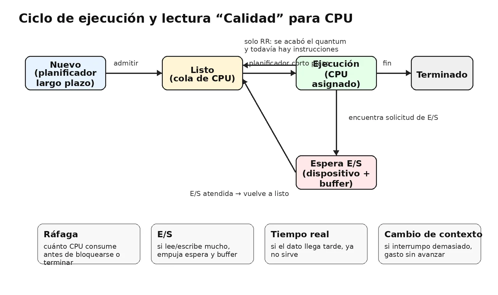

## Índice operativo

- [[#Zona 0 — Cómo leer cualquier caso de examen]]
- [[#Zona 1 — Tabla de procesos de la pizarra grande]]
- [[#Zona 2 — CPU y ciclo de ejecución]]
- [[#Zona 3 — Memoria]]
- [[#Zona 4 — Archivos]]
- [[#Zona 5 — Entrada/Salida]]
- [[#Zona 6 — Bloqueos e interbloqueos]]
- [[#Zona 7 — Sistemas distribuidos]]
- [[#Zona 8 — Preguntas tipo Calidad con respuesta razonada]]
- [[#Zona 9 — Chuleta final de decisión]]
- [[#Zona 10 — Estudio activo con Markdown]]
- [[Tablero_SO_Calidad|Tablero de estudio Make.md]]
- [[Mapa_Final_SO_Calidad.excalidraw|Abrir mapa Excalidraw interactivo]]

---

# Zona 0 — Cómo leer cualquier caso de examen

## 0.1 La regla de oro

Cuando le dan un caso con procesos, dispositivos, sensores, archivos o recursos, no se contesta desde el nombre bonito del proceso. Se contesta desde su comportamiento.

No es lo mismo decir:

> “El proceso analiza imágenes.”

que decir:

> “El proceso recibe una imagen de alta resolución, la conserva como archivo de entrada, posiblemente la fragmenta en regiones, ejecuta una rutina de comparación pesada sobre memoria principal, genera lecturas repetidas de disco y no necesariamente modifica el archivo original. Por eso su ráfaga puede ser alta, su E/S puede ser alta, su consumo de memoria puede crecer, y el buffer es útil para recibir la imagen completa o sus porciones antes de procesarlas.”

Ese segundo texto es el estilo correcto: **explica qué recurso se consume y por qué**.

## 0.2 Plantilla universal

Para cada proceso, use esta plantilla antes de decidir CPU, memoria, archivo, E/S o bloqueo.

| Pregunta | Qué se busca | Cómo se defiende |
|---|---|---|
| ¿Cuál es el dato de origen? | Sensor, archivo, cámara, micrófono, red, BD, usuario | “No analizo el resultado ya procesado; analizo lo que el dispositivo entrega en crudo.” |
| ¿Lee, escribe o ambas? | Posibles secciones críticas y tipo de archivo | Si solo lee, no modifica integridad; si escribe, puede crear conflicto. |
| ¿Es tiempo real? | Si llegar tarde vuelve inútil el dato | Frecuencia cardíaca, oxígeno, control de actuadores y alarmas suelen ser TR. |
| ¿Cómo es la ráfaga de CPU? | Algoritmo de planificación | Cálculo pesado = ráfaga alta; sensor simple = ráfaga baja. |
| ¿Cómo es la E/S? | Espera, buffer, driver, controlador | Si recibe datos constantemente, presiona buffer y cola de E/S. |
| ¿Cuánta memoria pide? | Particiones, paginación, swap, reemplazo | Imagen/audio/IA pueden crecer; sensor escalar suele ser pequeño. |
| ¿El dato se reutiliza? | Cache | Cache solo si hay repetición útil, no si cada dato nuevo reemplaza al anterior. |
| ¿Produce más rápido de lo que se consume? | Buffer | Buffer si necesito almacenar temporalmente mientras otro actor consume. |
| ¿Comparte recursos? | Bloqueos | Si retiene un recurso mientras espera otro, puede formar espera circular. |

## 0.3 Las cinco preguntas del último examen

Según lo que se ve en las pizarras y lo que se ha venido trabajando, el examen puede forzar una pregunta por cada frente:

1. **CPU:** elegir o justificar planificación según ráfaga, E/S, tiempo real, prioridad o cambio de contexto.
2. **Memoria:** decidir particiones, mapas de bits, listas ligadas, intercambio, paginación, reemplazo o cache.
3. **Archivos:** clasificar estructura, tipo, acceso, crecimiento, lectura/escritura, compartición y seguridad.
4. **Entrada/Salida:** distinguir dispositivo, controlador, manejador, buffer, cache, DMA, señal, disco, cola.
5. **Bloqueos:** detectar, evitar, prevenir o recuperar interbloqueos usando grafo, vector recorrido o matrices.

---

# Zona 1 — Tabla de procesos de la pizarra grande

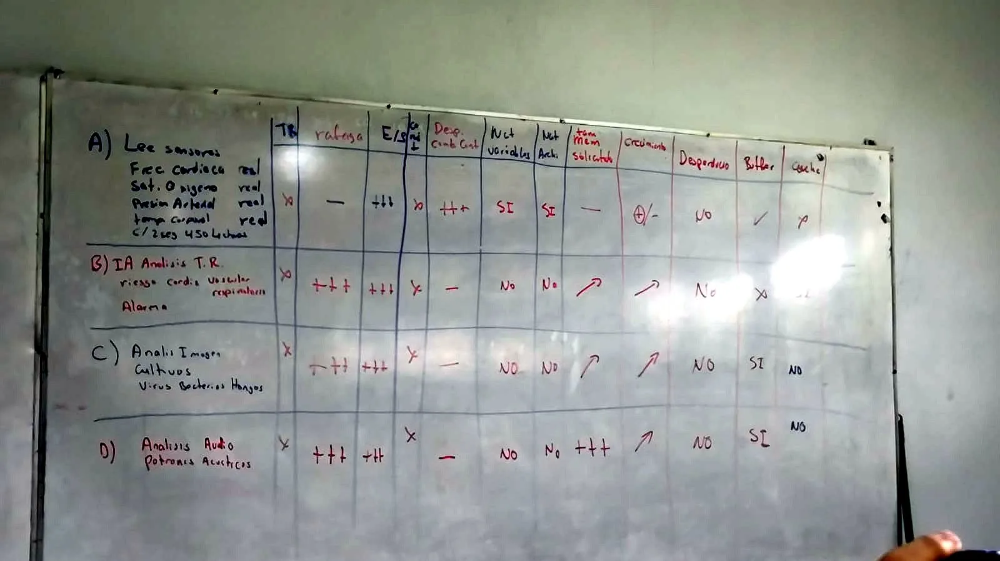

La primera pizarra es una matriz de caracterización. No es una tabla para memorizar marcas de “sí/no”. Es una tabla para entrenar el razonamiento: **dado un proceso, se decide qué tan fuerte golpea CPU, memoria, archivos, E/S, buffer, cache y riesgo de desperdicio**.

## 1.1 Columnas interpretadas

La imagen no permite leer todas las columnas con nitidez, pero por el patrón de clase y de exámenes se identifican estas dimensiones:

| Columna | Significado operativo |
|---|---|
| TR | Tiempo real. Importa si el dato pierde valor si llega tarde. |
| Ráfaga | Cantidad de CPU antes de bloquearse, esperar E/S o terminar. |
| E/S | Frecuencia o intensidad de lectura/escritura sobre dispositivos. |
| Lectura/Escritura | Si consume datos, modifica datos o ambas. |
| Desperdicio / crecimiento | Si el proceso puede pedir memoria de más o crecer durante ejecución. |
| Naturaleza de variables | Si son variables simples, señales, imágenes, audio, registros, arreglos, etc. |
| Naturaleza de archivo | Si el archivo se comporta como caracteres, registros, bloques, especial, etc. |
| Tamaño de memoria solicitado | Si pide poco, medio o mucho espacio. |
| Cache | Si conviene guardar datos frecuentemente usados. |
| Buffer | Si conviene almacenar temporalmente datos mientras se completan/consumen. |
| ¿Cuál? | Justificación puntual: qué buffer/cache/dispositivo/estructura se usaría. |

## 1.2 Proceso A — Lee sensores médicos

**Datos de la pizarra:** frecuencia cardíaca real, saturación de oxígeno real, presión arterial real, temperatura corporal real; medición cada 2 segundos y muchas lecturas.

### Caracterización

| Criterio | Lectura tipo Calidad |
|---|---|
| Dato de origen | Señales o mediciones de sensores médicos. |
| Tipo de dato | Numérico continuo o discreto según sensor: bpm, %, mmHg, °C. |
| Tiempo real | Sí o casi tiempo real. Si el dato llega tarde, ya no representa el estado actual. |
| Ráfaga CPU | Baja o media. Leer sensores no exige cálculo pesado; lo pesado aparece si se analiza tendencia. |
| E/S | Alta y constante. Cada sensor produce datos periódicamente. |
| Memoria | Baja por medición individual; puede crecer si se guarda histórico. |
| Archivo | Registros temporales o serie de tiempo. Estructura recomendada: registros con timestamp. |
| Buffer | Sí. El sensor puede producir mientras el proceso todavía no consume. |
| Cache | Generalmente no. El dato viejo no es el que interesa para actuar. |
| Riesgo | Pérdida de datos si el buffer se llena; decisión tardía si el proceso espera demasiado. |

### Cómo se explica

El punto fino es no confundir **frecuencia de datos** con **cálculo pesado**. Un sensor médico puede producir datos cada dos segundos; eso no significa que use mucha CPU. Lo que sí significa es que presiona la E/S y necesita un lugar donde depositar el dato mientras el proceso lo consume. Ahí aparece el **buffer**.

El cache no es natural porque no me interesa reutilizar la saturación de oxígeno de hace media hora para decidir la saturación actual. Si el proceso hace análisis histórico, ese histórico puede estar en archivo o base de datos; pero eso ya es otro proceso analítico, no la lectura cruda del sensor.

## 1.3 Proceso B — IA para análisis en tiempo real de riesgo cardiovascular

**Datos de pizarra:** IA, análisis en tiempo real, riesgo cardiovascular, alarma.

| Criterio | Lectura tipo Calidad |
|---|---|
| Dato de origen | Lecturas médicas previas o flujo de sensores. |
| Tiempo real | Sí, si dispara alarma. No sirve detectar un evento crítico cuando ya pasó. |
| Ráfaga CPU | Alta. IA implica comparación, inferencia, clasificación o predicción. |
| E/S | Media/alta. Lee variables de sensores o archivos de historial. |
| Memoria | Alta. Modelos, ventanas de datos, matrices, pesos, buffers temporales. |
| Archivo | Puede leer históricos y escribir resultados/alertas. |
| Buffer | Depende: sí si consume flujo de sensores. |
| Cache | Puede ser útil para patrones frecuentes, parámetros del modelo o variables de control usadas repetidamente. |
| Riesgo | Si se planifica mal, la alarma llega tarde. |

### Defensa

Este proceso no es solamente “lee datos”. Ya transforma datos en decisión. Por eso hay que separarlo del proceso A. El proceso A produce o registra lecturas; el proceso B **consume esas lecturas y calcula**.

En CPU conviene reconocerlo como proceso de ráfaga importante, pero si además es tiempo real, no puedo simplemente mandarlo detrás de todo por ser pesado. Debe recibir prioridad o política de tiempo real, porque la consecuencia de atraso es funcionalmente grave.

## 1.4 Proceso C — Análisis de imágenes de cultivos

**Datos de pizarra:** análisis de imágenes; cultivos; virus, bacterias, hongos.

| Criterio | Lectura tipo Calidad |
|---|---|
| Dato de origen | Imagen de cámara, microscopio o archivo de imagen. |
| Tiempo real | Usualmente no estricto, salvo diagnóstico crítico en línea. |
| Ráfaga CPU | Muy alta. Procesamiento de imagen implica muchos píxeles/regiones. |
| E/S | Alta al cargar imágenes; menor durante cálculo si ya están en memoria. |
| Memoria | Alta. Imagen completa, regiones, matrices, modelos. |
| Archivo | Archivo binario/imagen; acceso directo o mapeado puede servir. |
| Buffer | Sí para recibir imagen/porciones desde dispositivo o disco. |
| Cache | Puede servir si se reusan patrones, filtros, kernels o regiones de comparación. |
| Riesgo | Fallos de página si no cabe; mucho intercambio si se fuerza memoria virtual. |

### Defensa

La imagen no se analiza “como texto”. Es un volumen de datos. Si la imagen no cabe completa, se divide en regiones; cada región puede convertirse en páginas o bloques. La operación crítica es mantener en memoria principal la región que se está procesando y mandar a intercambio lo que no se usa todavía.

## 1.5 Proceso D — Análisis de audio y patrones acústicos

| Criterio | Lectura tipo Calidad |
|---|---|
| Dato de origen | Micrófono o archivo de audio. |
| Tiempo real | Depende: si detecta alarma acústica inmediata, sí; si analiza grabación, no. |
| Ráfaga CPU | Alta si extrae patrones, espectrogramas, frecuencias o reconocimiento. |
| E/S | Alta al capturar stream o cargar grabaciones. |
| Memoria | Media/alta según duración del audio y ventana de análisis. |
| Archivo | Stream de bytes, archivo binario, muestras temporales. |
| Buffer | Sí. El audio llega como flujo y no puede perder muestras. |
| Cache | Solo si se reutilizan patrones/modelos; no para cada muestra nueva. |
| Riesgo | Si el buffer se llena, se pierden muestras o se corta el análisis. |

---

# Zona 2 — CPU y ciclo de ejecución


## 2.1 Proceso no es programa guardado

Un programa es una pila de código almacenada. Un proceso es esa pila de código **en ejecución**, con estado, contador de programa, variables, memoria asignada, archivos abiertos y recursos solicitados.

La forma correcta de verlo:

```text
Programa quieto en disco
        ↓ se carga/admite
Proceso en ciclo de ejecución
        ↓ se planifica
CPU ejecuta una porción de instrucciones
```

## 2.2 Estados importantes

| Estado | Qué significa | Cola asociada |
|---|---|---|
| Nuevo | Solicita entrar al sistema | Entrada / admisión |
| Listo | Tiene lo necesario para ejecutar, pero espera CPU | Cola de listos |
| Ejecución | Tiene CPU asignado | CPU |
| Espera por E/S | Encontró una instrucción que depende de dispositivo | Cola del dispositivo |
| Terminado | Ya no requiere CPU | Salida |

## 2.3 Planificador de largo plazo y corto plazo

### Largo plazo

Decide qué procesos nuevos entran al ciclo. Su pregunta es:

> ¿Conviene meter más procesos al sistema o voy a saturar memoria/E/S/CPU?

### Corto plazo

Decide cuál proceso de la cola de listos entra a CPU. Su pregunta es:

> De los procesos que ya están listos, ¿quién usa el CPU ahora?

## 2.4 La única vuelta de ejecución a listo

La pizarra y las transcripciones insisten en este punto: un proceso que está en ejecución vuelve a listo **por Round Robin**, cuando:

1. Se terminó su quantum.
2. Aún tiene instrucciones pendientes.
3. No encontró una instrucción de E/S antes de terminar el quantum.

Si encuentra E/S, no vuelve a listo: va a **espera por entrada/salida**.

## 2.5 Criterios de planificación CPU

| Criterio | Traducción práctica |
|---|---|
| Eficacia | Que todos logren ejecutarse; no dejar procesos condenados. |
| Eficiencia | Balancear colas: no CPU lleno y E/S vacío, ni E/S lleno y CPU ocioso. |
| Rendimiento | Mantener CPU ocupado y sacar procesos por unidad de tiempo. |
| Tiempo de respuesta | Desde que entra hasta que termina. |
| Tiempo de espera | Cuánto pasa en cola sin ejecutar. |
| Cambio de contexto | Costo de quitar un proceso y poner otro. |

## 2.6 Algoritmos que pueden aparecer

### FCFS — Primero en llegar, primero en ser servido

Funciona bien si se quiere simplicidad. Es malo si entra primero un proceso con ráfaga larguísima y detrás quedan procesos pequeños.

**Calidad diría:** si el primero se montó con una ráfaga larguísima, el resto queda viendo para el techo.

### SJF — Primero el trabajo más corto

Reduce espera promedio si se conoce o estima la duración. Problema: puede castigar procesos largos.

### Round Robin

Da una tajada igual de CPU a cada proceso. Es útil para sistemas interactivos, pero si el quantum es muy pequeño, el sistema gasta demasiado en cambios de contexto.

Punto fino: si un proceso tiene una operación que debe completar de manera atómica o retiene recursos que no puede liberar hasta terminar, Round Robin puede complicar bloqueos, porque lo interrumpe antes de cerrar la operación.

### Prioridades

Útil cuando hay procesos críticos, alarmas o tiempo real. Riesgo: inanición de procesos de baja prioridad.

### Tiempo real

No pregunta solo “cuánto tarda”. Pregunta si el resultado sirve si llega tarde. Una alarma médica tardía puede ser técnicamente correcta, pero funcionalmente inútil.

## 2.7 Cómo decidir CPU en un caso

1. Si el proceso tiene **tiempo real**, priorice cumplimiento temporal.
2. Si la ráfaga es corta y conocida, SJF puede tener sentido.
3. Si hay usuarios interactivos, RR puede tener sentido.
4. Si hay procesos críticos y no críticos, prioridad puede tener sentido.
5. Si hay mucha E/S, no mida solo CPU; revise cola de dispositivo.
6. Si el proceso retiene recursos, cuidado con RR y bloqueos.

---

# Zona 3 — Memoria

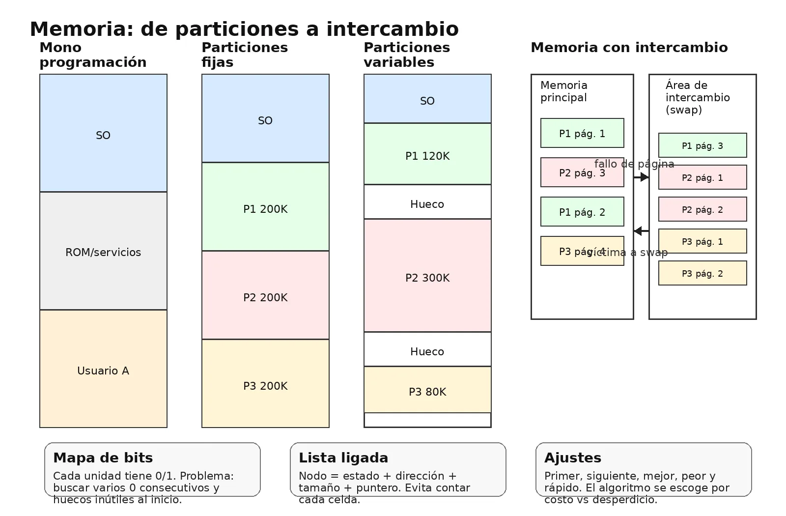

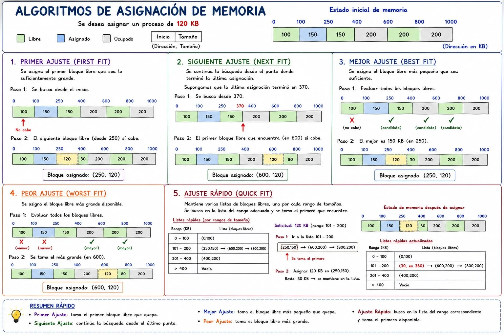

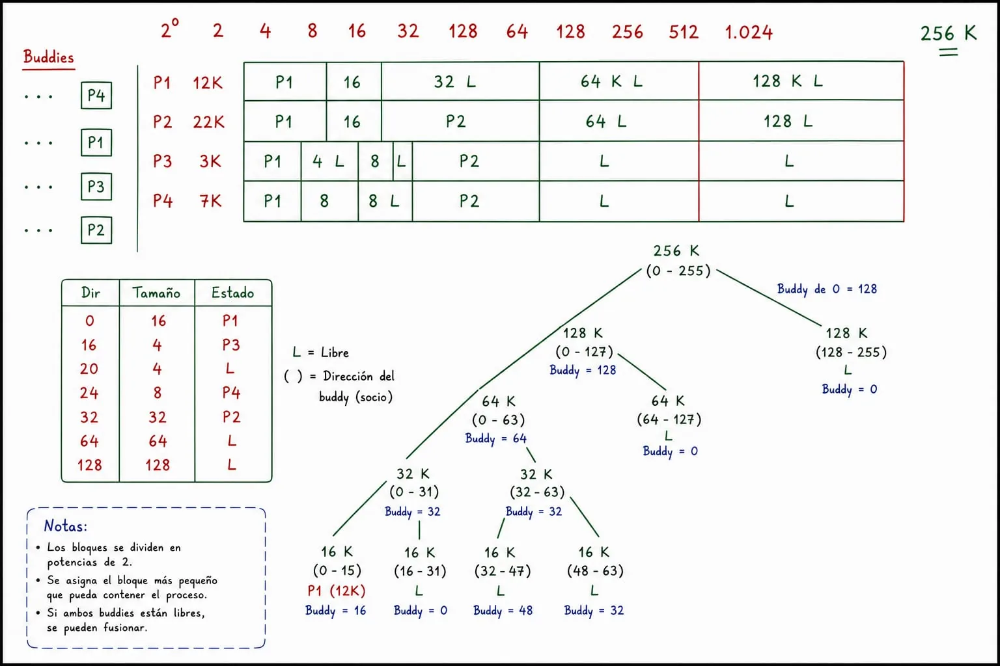

## 3.1 La analogía de Calidad: memoria como locker/pupitre/pizarra

La memoria principal es el área inmediata de trabajo. No todo lo que un proceso necesita cabe ahí. Antes del intercambio, si no cabía, el proceso esperaba. Con intercambio, aparece una extensión: el área de swap.

La idea no es que el disco se vuelva igual de rápido que la RAM. La idea es que, lógicamente, el sistema puede fingir que tiene más memoria, manteniendo en RAM lo que más se necesita y mandando al área de intercambio lo que no está activo.

## 3.2 Memoria sin intercambio

### 3.2.1 Monoprogramación

Un solo programa de usuario. La memoria se reparte en:

```text
Sistema operativo / servicios
ROM o rutinas base
Programa de usuario
```

No hay competencia fuerte entre procesos, pero el aprovechamiento es bajo.

### 3.2.2 Multiprogramación con particiones fijas del mismo tamaño

La memoria se divide en bloques iguales. Ventaja: administración rápida. Desventaja: desperdicio.

Ejemplo:

```text
Bloques de 200K
P1 ocupa 70K  → desperdicia 130K
P2 ocupa 180K → desperdicia 20K
P3 ocupa 210K → no entra
```

El tamaño del bloque se define por el proceso más grande conocido. Problema: si llega un proceso más grande que ese histórico, queda sin poder ejecutarse.

### 3.2.3 Particiones fijas de varios tamaños

Hay bloques pequeños, medianos y grandes. Reduce desperdicio, pero crea colas por tamaño. Si todos necesitan bloques grandes, la cola grande se satura mientras los bloques pequeños quedan subutilizados.

### 3.2.4 Reasignación y protección

Cuando un proceso crece y su bloque no alcanza, se busca espacio adicional. La protección evita que el proceso invada variables de otro proceso. La idea importante es atomicidad: **reasigno y protejo**. Si solo reasigno y no protejo, puedo corromper memoria ajena.

## 3.3 Particiones variables

Se asigna memoria según lo que el proceso pide. Suena más justo, pero abre dos problemas:

1. Fragmentación externa: huecos libres dispersos.
2. Costo de búsqueda: encontrar dónde cabe el proceso.

## 3.4 Mapa de bits

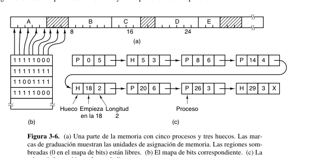

Un mapa de bits representa la memoria como unidades. Cada unidad tiene un bit:

```text
1 = ocupado
0 = libre
```

Para asignar 5 bloques, no sirve encontrar 2 libres aquí y 3 libres allá. Deben ser 5 bloques consecutivos si el modelo exige continuidad.

### Problema típico

El algoritmo empieza desde el inicio. Por eso el inicio de memoria se trilla: se llena de huecos pequeños que no sirven para solicitudes medianas o grandes.

### Solución costosa: desfragmentación

Desfragmentar significa detener el motor, acomodar procesos al inicio y dejar huecos libres al final. Es cara porque afecta rendimiento, tiempo de respuesta y disponibilidad.

## 3.5 Listas ligadas

En lugar de mirar bit por bit, se usan nodos:

```text
[Estado | Dirección inicial | Tamaño | Puntero siguiente]
```

Donde estado puede ser libre/ocupado. La ventaja es que el nodo ya dice el tamaño del hueco; no tengo que contar celdas una por una.

## 3.6 Algoritmos de ajuste

| Algoritmo | Qué hace | Ventaja | Problema |
|---|---|---|---|
| Primer ajuste | Mete el proceso en el primer hueco donde quepa | Rápido | Trilla el inicio y puede desperdiciar mucho |
| Siguiente ajuste | Empieza desde donde quedó el último puntero | Reparte desgaste | Puede saltarse huecos buenos |
| Mejor ajuste | Busca el hueco más ajustado | Reduce desperdicio inmediato | Recorre mucho y deja huecos diminutos |
| Peor ajuste | Usa el hueco más grande | Deja espacio para crecer | Puede consumir bloques valiosos |
| Ajuste rápido | Mantiene listas/cache de tamaños frecuentes | Muy rápido para casos comunes | Requiere mantenimiento adicional |

### Ejemplo de la pizarra: solicitud de 120 KB

Estado inicial:

| Inicio | Tamaño | Estado interpretado |
|---:|---:|---|
| 0 | 100 KB | Libre, pero no cabe 120 KB |
| 100 | 150 KB | Asignado/ocupado según el ejemplo |
| 250 | 150 KB | Libre, sí cabe |
| 400 | 200 KB | Ocupado |
| 600 | 200 KB | Libre, sí cabe |
| 800 | 200 KB | Libre, sí cabe |

| Algoritmo | Bloque elegido en la pizarra | Residuo | Lectura tipo Calidad |
|---|---:|---:|---|
| Primer ajuste | 250, 150 KB | 30 KB | Barre desde el inicio; ignora 100 porque no cabe y toma el primer hueco suficiente. |
| Siguiente ajuste | 600, 200 KB | 80 KB | Arranca desde el último punto de búsqueda; no garantiza menos desperdicio, solo cambia el recorrido. |
| Mejor ajuste | 250, 150 KB | 30 KB | Elige el hueco suficiente más pequeño; reduce desperdicio inmediato. |
| Peor ajuste | 600, 200 KB | 80 KB | Parte un hueco grande; puede servir si se quiere dejar residuos todavía utilizables. |
| Ajuste rápido | Lista 101-200; toma 250, 150 KB | 30 KB | No busca toda la memoria; consulta la lista del rango de tamaño adecuado. |

> [!warning] Error típico
> No diga que “mejor ajuste siempre es mejor”. Es mejor en desperdicio inmediato, pero puede costar más búsqueda y dejar huecos pequeños que luego no sirven.

### Cómo defender peor ajuste

No diga “es malo porque desperdicia”. La defensa correcta es:

> Si el histórico muestra que el proceso crece durante ejecución, asignarle un hueco grande puede evitar una reasignación posterior, reducir movimiento y evitar que el administrador de memoria tenga que salvarlo a mitad de ejecución.

## 3.7 Sistema de buddies socios

El sistema de buddies divide la memoria en bloques de tamaño potencia de 2. Si un proceso pide 12 KB, no se le da exactamente 12 KB: se le asigna el bloque potencia de 2 más pequeño que lo pueda contener, en este caso 16 KB.

Reglas de la pizarra:

| Regla | Qué significa |
|---|---|
| Bloques en potencias de 2 | 4, 8, 16, 32, 64, 128, 256 KB, etc. |
| Se asigna el menor bloque suficiente | 12 KB entra en 16 KB; 22 KB entra en 32 KB. |
| Cada bloque tiene un socio | El buddy se calcula por la división binaria del bloque padre. |
| Si ambos socios quedan libres | Se fusionan para reconstruir el bloque padre. |
| Si uno está ocupado | No se puede fusionar aunque el otro esté libre. |

Ejemplo de la imagen:

| Proceso | Solicitud | Bloque asignado | Desperdicio interno |
|---|---:|---:|---:|
| P1 | 12 KB | 16 KB | 4 KB |
| P2 | 22 KB | 32 KB | 10 KB |
| P3 | 3 KB | 4 KB | 1 KB |
| P4 | 7 KB | 8 KB | 1 KB |

> [!tip] Defensa de examen
> Buddies es más rápido para dividir y fusionar que una búsqueda arbitraria de huecos, porque la memoria tiene estructura de árbol. El precio es desperdicio interno por redondear a potencias de 2.

La frase fuerte:

> “Uso buddies si quiero administración rápida y coalescencia clara. No lo defiendo como asignación exacta, porque justamente redondea y puede desperdiciar dentro del bloque.”

## 3.8 Memoria con intercambio / memoria virtual

La memoria virtual reserva una porción del disco como área de intercambio. Esa porción no se usa como almacenamiento normal de archivos, sino como extensión lógica de memoria principal.

```text
Memoria principal = lo que está en el pupitre
Swap/intercambio = lo que está en el locker o aula de al frente
Proceso completo = pupitre + locker + bicicleta en parqueo
```

Lo importante: físicamente están en lugares distintos; lógicamente pertenecen al mismo proceso.

## 3.9 Páginas y marcos

| Concepto | Explicación |
|---|---|
| Página | Porción del espacio lógico del proceso. |
| Marco | Espacio físico en memoria principal donde puede cargarse una página. |
| Fallo de página | El proceso necesita una página que no está en memoria principal. |
| Página víctima | Página que se saca para hacer espacio. |
| Bit de presencia | Indica si la página está en RAM. |
| Bit de modificación | Indica si debe escribirse antes de sacarse. |

## 3.10 Secuencia de fallo de página

```text
1. El proceso referencia una dirección lógica.
2. La tabla de páginas dice: no está presente.
3. Se produce trap/fallo de página.
4. El SO localiza la página en disco/swap/archivo.
5. Busca marco libre.
6. Si no hay marco libre, escoge víctima.
7. Si la víctima está modificada, la escribe a disco.
8. Carga la página solicitada.
9. Actualiza tabla de páginas.
10. Reinicia la instrucción.
```

## 3.11 Algoritmos de reemplazo de páginas

| Algoritmo | Idea | Cómo defenderlo |
|---|---|---|
| Óptimo | Saca la página que se usará más tarde en el futuro | Es ideal teórico; no se conoce el futuro. |
| FIFO | Saca la que llegó primero | Simple; puede sacar páginas muy usadas. |
| Segunda oportunidad | FIFO pero revisa bit de referencia | Si fue usada recientemente, se le da otra vuelta. |
| Reloj | Segunda oportunidad en estructura circular | Más eficiente que mover colas largas. |
| NRU | Clasifica por referenciada/modificada | Saca la que menos daño causa. |
| LRU | Saca la menos usada recientemente | Aproxima localidad temporal; caro si se implementa exacto. |
| Conjunto de trabajo | Mantiene páginas usadas en una ventana reciente | Reduce thrashing si se estima bien. |
| WSClock | Combina reloj con conjunto de trabajo | Compromiso entre costo y precisión. |

## 3.12 Thrashing

Thrashing ocurre cuando el proceso parece estar ejecutando, pero realmente consume mucho tiempo trayendo y sacando páginas. En la pizarra se explicó como una ráfaga que parece buena, pero engaña: gran parte del tiempo se está yendo en intercambio, no en trabajo útil.

## 3.13 Cache vs buffer en memoria

| Pregunta | Buffer | Cache |
|---|---|---|
| ¿Para qué existe? | Para guardar temporalmente mientras se completa o consume. | Para reutilizar algo frecuente. |
| ¿El dato se espera reutilizar? | No necesariamente. | Sí. |
| ¿Ejemplo de clase? | Sensor produce cada 2 segundos y el proceso no consume a tiempo. | Variables del PCB o patrón usado repetidamente. |
| Error común | Decir buffer cuando solo quiero velocidad. | Decir cache para datos frescos que no se reutilizan. |

---

# Zona 4 — Archivos

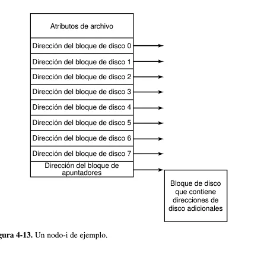

## 4.1 Las tres finalidades de un sistema de archivos

### 1. Perpetuar información

Sin archivo, el resultado de un proceso se pierde al terminar o apagar. El archivo permite que el resultado exista después de la ejecución.

### 2. Almacenar grandes volúmenes

La memoria principal no es para guardar todo permanentemente. El sistema de archivos permite almacenar grandes cantidades en almacenamiento secundario.

### 3. Compartir información

Un archivo puede ser usado por varios procesos o usuarios. Eso exige permisos, perfiles, operaciones permitidas y control de concurrencia.

## 4.2 No se clasifica el proceso; se clasifica cada archivo

Error frecuente: “el proceso H usa archivo de sensores”.

Forma correcta:

```text
Proceso H usa tres dispositivos:
1. Sensor de humedad  → archivo de humedad
2. Sensor de temperatura → archivo de temperatura
3. Sensor de brillo solar → archivo de brillo
```

Cada dispositivo genera una data distinta. Cada data puede construir un archivo distinto.

## 4.3 Dato de origen

Dato de origen es lo que el dispositivo entrega antes de que usted lo procese.

Ejemplos:

| Dispositivo | Dato de origen | Archivo probable |
|---|---|---|
| Sensor DHT11 | Temperatura y humedad | Registro periódico con timestamp |
| Piranómetro | Irradiancia solar | Serie de mediciones numéricas |
| Cámara | Imagen / frame | Archivo binario o stream de imagen |
| Micrófono | Muestras de audio | Stream binario de audio |
| Lector de código | ID leído | Registro de evento |
| Disco | Bloques/sectores | Archivo reconstruido por el SO |

## 4.4 Estructura de archivo

| Estructura | Cuándo aparece | Ejemplo |
|---|---|---|
| Secuencia de bytes/caracteres | Texto, logs, cadenas, lectura simple | ADN como caracteres, log de sensor |
| Secuencia de registros | Datos repetidos con campos | timestamp + temperatura + humedad |
| Árbol/índice | Búsqueda por clave | Base de datos, índice de pacientes |
| Binario estructurado | Imagen, audio, video, modelo IA | JPEG, WAV, matriz serializada |

## 4.5 Tipo de archivo

| Tipo | Significado |
|---|---|
| Regular | Contiene datos del usuario: texto, binario, imagen, audio. |
| Directorio | Contiene referencias a archivos. |
| Especial de caracteres | Dispositivo que entrega flujo de caracteres/bytes: teclado, puerto, sensor, micrófono. |
| Especial de bloques | Dispositivo que trabaja por bloques: disco, SSD. |

## 4.6 Acceso a archivos

| Acceso | Cuándo conviene |
|---|---|
| Secuencial | Logs, audio continuo, stream, lectura lineal. |
| Directo/aleatorio | Base de datos, imágenes por regiones, bloques específicos. |
| Indexado | Cuando se busca por clave o atributo. |
| Mapeado a memoria | Cuando tratar el archivo como memoria simplifica el acceso. |

## 4.7 Crecimiento de archivo y seguridad

Calidad usa un razonamiento heurístico: un archivo de código fuente crece en KB, no en GB por sesión normal. Si un archivo crece de forma absurda, puede ser comportamiento sospechoso.

Ejemplo:

```text
archivo.py normalmente crece 20 KB por sesión
hoy creció 900 MB
→ revisar: log infinito, binario incrustado, malware, error de escritura
```

## 4.8 Nodo-i

El nodo-i contiene atributos y direcciones de bloques del archivo. La ventaja es que el sistema no necesita tener toda una tabla gigante de todos los bloques de todos los archivos en memoria. Solo necesita cargar el nodo-i del archivo abierto.

## 4.9 Cómo responder una pregunta de archivo por sensor

Plantilla:

```text
El sensor entrega [dato de origen].
Ese dato se registra como [estructura].
El archivo es de tipo [regular/especial].
El acceso recomendado es [secuencial/directo/indexado].
Si la frecuencia de producción es alta, requiere buffer.
Si los datos se reutilizan para comparación frecuente, puede requerir cache.
```

Ejemplo:

> Sensor de temperatura: entrega valores numéricos periódicos. Construye un archivo regular de registros, cada registro con timestamp y valor. El acceso natural es secuencial para registro histórico; puede tener acceso indexado por tiempo si se consulta por rangos. Requiere buffer si el sensor produce más rápido que el proceso que escribe. Cache no es lo principal porque el dato nuevo tiene más valor que el dato viejo.

---

# Zona 5 — Entrada/Salida

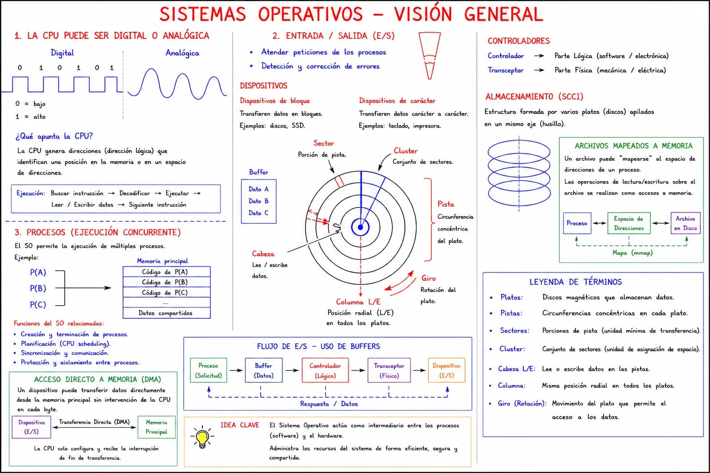

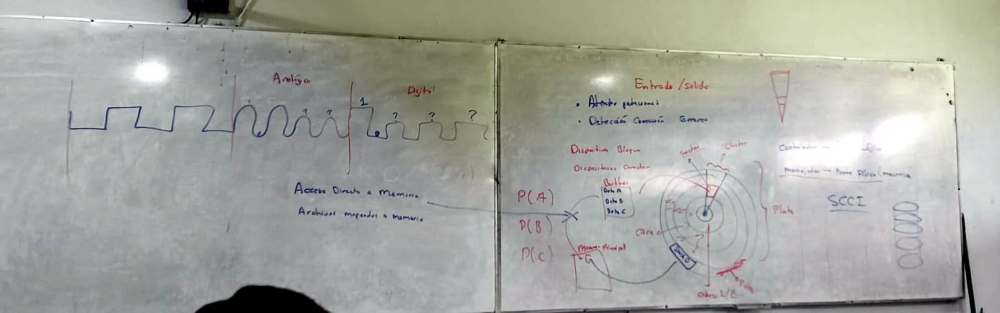

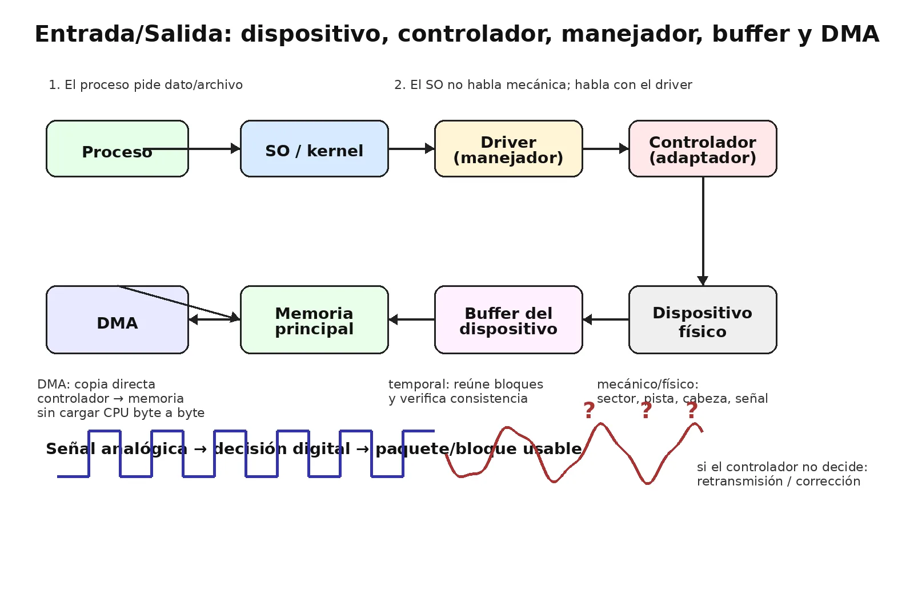

## 5.1 Entrada/Salida no es solo “leer y escribir”

Entrada/Salida es el conjunto de mecanismos que permiten que un proceso se comunique con dispositivos externos a CPU y memoria principal: discos, red, cámara, teclado, sensores, micrófono, impresora.

## 5.2 Dispositivo, controlador y manejador

| Capa | Qué hace | Ejemplo |
|---|---|---|
| Dispositivo físico | Parte mecánica o eléctrica que produce/consume señales | Disco, sensor, micrófono, impresora |
| Controlador/adaptador | Electrónica que traduce señales y expone registros/interfaz | Controlador SATA, tarjeta de red |
| Driver/manejador | Software del SO que sabe hablar con el controlador | Driver de disco, driver de red |
| Software independiente del dispositivo | Abstracciones comunes: bloques, archivos, permisos, nombres | VFS, cola de impresión |
| Proceso usuario | Pide leer, escribir, imprimir, enviar, recibir | Aplicación |

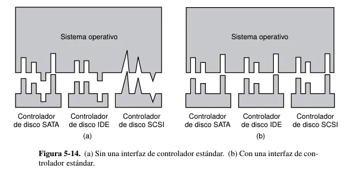

## 5.3 Parte mecánica vs parte lógica

En un disco:

- Mecánico/físico: plato, pista, sector, cabeza, movimiento, latencia rotacional.
- Lógico: qué petición atiendo primero, cómo ordeno la cola, cómo reconstruyo el archivo, cómo verifico errores.

En una red:

- Físico: señal, medio, enlace, tarjeta.
- Lógico: paquetes, retransmisión, checksum, orden, buffer.

## 5.4 Buffer: explicación de los “rojos”

El archivo no se trae completo a memoria principal si no cabe. El dispositivo va encontrando bloques/sectores del archivo y los reúne en un almacenamiento temporal.

Ese almacenamiento temporal es el buffer.

La idea:

```text
Disco contiene bloques dispersos del archivo.
El controlador/driver los va localizando.
Los coloca en buffer.
Cuando la solicitud está consistente, se entrega al proceso o a memoria principal.
```

No es “copiar por copiar”. Es **reunir, verificar y disponer** para que el proceso no tenga que recorrer el dispositivo completo.

## 5.5 ¿Por qué no cache?

Porque el buffer existe para temporalidad y sincronización. El cache existe para reutilización.

Si el dato es una lectura única que se junta para entregar, es buffer. Si el mismo bloque se consulta muchas veces, ahí puede aparecer cache.

## 5.6 DMA

DMA permite que el controlador transfiera datos directamente a memoria principal sin que la CPU copie byte por byte.

```text
Sin DMA:
Dispositivo → CPU → memoria

Con DMA:
Dispositivo/controlador → memoria
CPU solo configura y recibe interrupción al final
```

Esto mejora rendimiento porque la CPU no se desperdicia moviendo cada byte.

> [!important] Matiz de Tanenbaum
> DMA no significa que la CPU desaparece. La CPU configura dirección, tamaño y operación; después el controlador/DMA mueve el bloque y avisa con interrupción. La ganancia está en evitar que la CPU copie cada byte o carácter.

## 5.7 Interrupciones

Cuando un dispositivo termina una operación, puede interrumpir al CPU para avisar. Así el CPU no tiene que estar preguntando constantemente “¿ya terminó?”.

## 5.8 Señal analógica y decisión digital

La pizarra muestra ondas claras y ondas dudosas. En dispositivos reales, no todo llega perfecto.

El controlador o la capa de comunicación debe decidir si una señal representa 0, 1, ruido o error. Si hay duda, se puede pedir retransmisión.

Ejemplo de red:

```text
Paquete llega con error
↓
checksum no coincide
↓
se descarta y se pide retransmisión
```

## 5.9 Disco: plato, pista, sector, clúster

| Concepto | Significado |
|---|---|
| Plato | Superficie física del disco. |
| Cara | Lado del plato que puede leerse/escribirse. |
| Pista | Circunferencia donde se almacenan sectores. |
| Sector | Unidad física mínima tradicional. |
| Clúster | Agrupación lógica de sectores usada por sistema de archivos. |
| Cabeza | Elemento que lee/escribe al pasar sobre la pista. |
| Cola de peticiones | Solicitudes pendientes de procesos A, B, C. |

## 5.10 Archivos mapeados a memoria mmap

La pizarra de visión general conecta archivos, memoria y E/S con la idea de **archivo mapeado a memoria**.

```text
Proceso
  ↓ ve direcciones
Espacio de direcciones
  ↓ mapa
Archivo en disco
```

La idea no es “leer todo el archivo”. La idea es que el proceso trabaja con direcciones y el sistema operativo trae las porciones necesarias del archivo como páginas.

| Cuándo tiene sentido | Por qué |
|---|---|
| Archivo muy grande | Evita cargarlo completo si solo se usan regiones. |
| Acceso por partes | Imagen, tabla grande, base de datos, video, índice. |
| Bajo riesgo de corrupción | Si se escribe directo o se manipula el origen, hay que cuidar integridad. |
| Localidad de referencia | Si se trabaja por zonas, paginación puede traer lo necesario. |

> [!warning] Error típico
> No confunda DMA con mmap. DMA es una forma de transferir datos entre dispositivo y memoria. mmap es una forma de presentar un archivo dentro del espacio de direcciones del proceso.

## 5.11 Cómo recomendar mejoras de dispositivo en examen

No basta decir “use un mejor sensor”. Hay que separar:

### Requisito controlador

- Resolución de lectura.
- Tasa de muestreo.
- Corrección de errores.
- Buffer interno.
- Interfaz estándar.
- Capacidad de interrupciones o DMA.

### Requisito manejador/driver

- Cola de solicitudes.
- Política de prioridad.
- Conversión de formato.
- Validación de consistencia.
- Manejo de errores.
- Exposición como archivo/dispositivo especial.

---

# Zona 6 — Bloqueos e interbloqueos

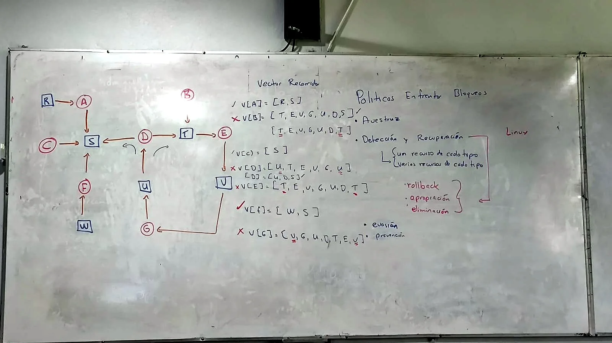

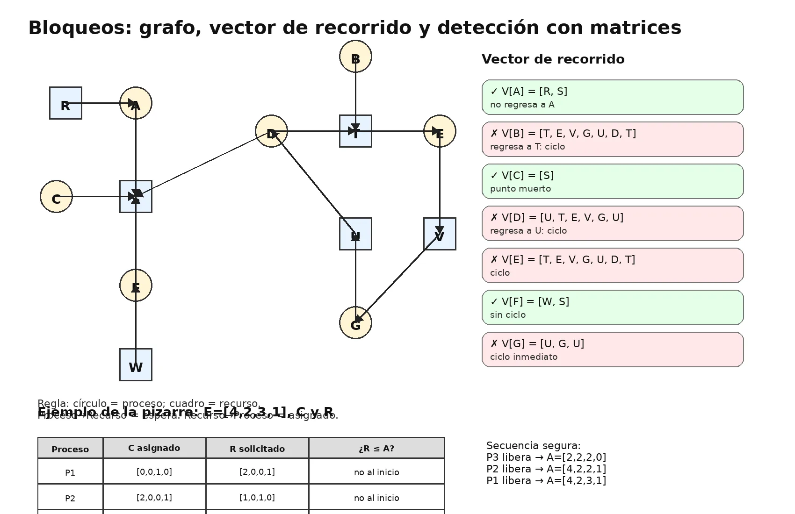

## 6.1 Definición operativa

Un bloqueo o interbloqueo ocurre cuando un proceso o conjunto de procesos no avanza porque espera un evento que:

1. ya pasó,
2. nunca sucederá, o
3. debe generar otro proceso del mismo conjunto que también está esperando.

## 6.2 Recursos apropiativos y no apropiativos

| Tipo | Explicación | Riesgo |
|---|---|---|
| Apropiativo | Se puede quitar a un proceso y reasignar | Menor riesgo si se puede salvar estado |
| No apropiativo | No se puede quitar hasta que el proceso lo libere | Riesgo alto de interbloqueo |

Ejemplo: una impresora durante una impresión física puede comportarse como no apropiativa; una página de memoria puede ser apropiativa si se puede escribir a swap y reasignar.

## 6.3 Las cuatro condiciones de Coffman

Para que haya interbloqueo deben estar presentes:

1. **Exclusión mutua:** un recurso no puede ser usado por todos a la vez.
2. **Contención y espera:** un proceso retiene un recurso mientras espera otro.
3. **No apropiación:** el recurso no se le puede quitar por la fuerza.
4. **Espera circular:** P1 espera algo de P2, P2 de P3, ..., Pn de P1.

Si rompo una condición, prevengo el interbloqueo.

## 6.4 Grafo de asignación de recursos

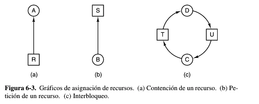

Reglas:

```text
Proceso = círculo
Recurso = cuadrado
Recurso → Proceso = recurso asignado
Proceso → Recurso = proceso esperando recurso
Ciclo = sospecha de interbloqueo
```

Si hay un solo recurso de cada tipo, ciclo implica interbloqueo. Si hay varios recursos de cada tipo, el ciclo no siempre basta; se requiere algoritmo matricial.

## 6.5 Vector de recorrido

El vector de recorrido sirve para seguir caminos en el grafo.

Ejemplo de pizarra:

```text
V[A] = [R, S]          ✓ no vuelve a A
V[B] = [T, E, V, G, U, D, T]  ✗ vuelve a T
V[C] = [S]            ✓ no ciclo
V[D] = [U, T, E, V, G, U]     ✗ vuelve a U
V[G] = [U, G, U]              ✗ ciclo
```

Interpretación: cuando en el recorrido aparece de nuevo un nodo ya visitado, hay ciclo. Si ese ciclo implica procesos esperando recursos que retienen otros procesos del ciclo, el sistema no avanza.

## 6.6 Detección con varios recursos de cada tipo

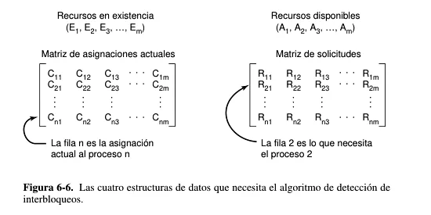

Estructuras:

| Símbolo | Significado |
|---|---|
| E | Vector de recursos existentes. Total de cada tipo. |
| A | Vector de recursos disponibles. Lo que no está asignado. |
| C | Matriz de asignaciones actuales. Qué tiene cada proceso. |
| R | Matriz de solicitudes. Qué necesita cada proceso para terminar. |

Relación:

```text
A = E - suma_columnas(C)
```

## 6.7 Ejemplo de la pizarra del banquero/detección

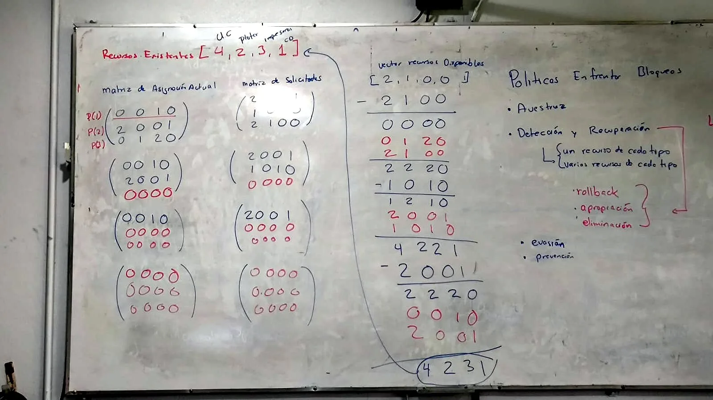

Recursos existentes:

```text
E = [4, 2, 3, 1]
```

Matriz de asignaciones actuales:

```text
C(P1) = [0, 0, 1, 0]
C(P2) = [2, 0, 0, 1]
C(P3) = [0, 1, 2, 0]
```

Suma asignada:

```text
ΣC = [2, 1, 3, 1]
```

Disponible inicial:

```text
A = E - ΣC
A = [4,2,3,1] - [2,1,3,1]
A = [2,1,0,0]
```

Matriz de solicitudes:

```text
R(P1) = [2, 0, 0, 1]
R(P2) = [1, 0, 1, 0]
R(P3) = [2, 1, 0, 0]
```

### Paso 1

Con A = [2,1,0,0]:

```text
P1 pide [2,0,0,1] → no, falta recurso 4
P2 pide [1,0,1,0] → no, falta recurso 3
P3 pide [2,1,0,0] → sí
```

P3 puede terminar y libera C(P3):

```text
A = [2,1,0,0] + [0,1,2,0]
A = [2,2,2,0]
```

### Paso 2

Con A = [2,2,2,0]:

```text
P2 pide [1,0,1,0] → sí
```

P2 termina y libera:

```text
A = [2,2,2,0] + [2,0,0,1]
A = [4,2,2,1]
```

### Paso 3

Con A = [4,2,2,1]:

```text
P1 pide [2,0,0,1] → sí
```

P1 termina y libera:

```text
A = [4,2,2,1] + [0,0,1,0]
A = [4,2,3,1]
```

Secuencia segura:

```text
P3 → P2 → P1
```

Conclusión: en ese estado no hay interbloqueo, porque existe una secuencia en la que todos pueden terminar.

## 6.8 Políticas frente a bloqueos

| Política | Qué hace | Cuándo se justifica |
|---|---|---|
| Avestruz | Ignora el problema | Si el costo de prevenir/detectar es mayor que el daño esperado. |
| Detección y recuperación | Permite que ocurra, luego detecta y corrige | Sistemas donde el bloqueo es raro pero posible. |
| Evasión | Decide si concede recursos solo si el estado sigue seguro | Algoritmo del banquero. |
| Prevención | Rompe una condición de Coffman | Sistemas críticos donde no se acepta bloqueo. |

## 6.9 Recuperación

| Técnica | Explicación | Costo |
|---|---|---|
| Rollback | Devolver proceso a punto seguro | Requiere checkpoints. |
| Apropiación | Quitar recurso a un proceso | Solo si se puede salvar estado. |
| Eliminación | Matar proceso | Fuerte, pero libera recursos. |

---

# Zona 7 — Sistemas distribuidos

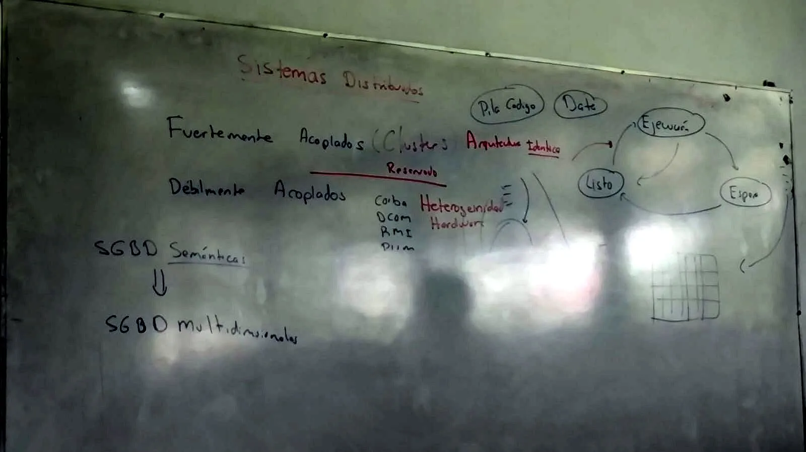

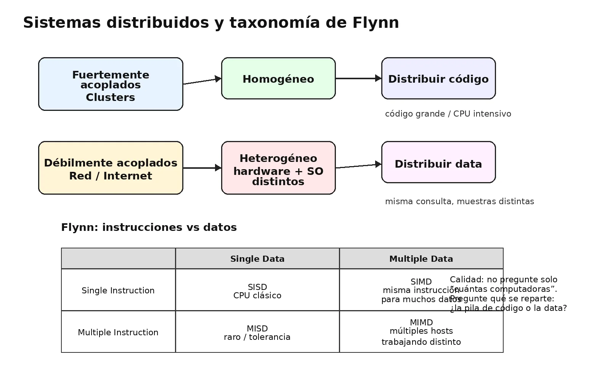

## 7.1 Idea central

Un sistema distribuido no es simplemente “varias computadoras”. Es un sistema donde un trabajo se reparte entre nodos que cooperan. La pregunta de Calidad sería:

> ¿Qué estoy distribuyendo: la pila de código, la data o ambas?

## 7.2 Fuertemente acoplados vs débilmente acoplados

| Modelo | Característica | Ejemplo |
|---|---|---|
| Fuertemente acoplado | Nodos cercanos, red rápida, administración común | Cluster |
| Débilmente acoplado | Nodos dispersos, red general, autonomía | Internet / servicios distribuidos |

## 7.3 Homogéneo vs heterogéneo

| Modelo | Significado |
|---|---|
| Homogéneo | Arquitectura, SO o entorno similares. |
| Heterogéneo | Diferentes hardware, SO, capacidad, red o administración. |

## 7.4 Distribuir código

Conviene cuando la pila de código o el cálculo es pesado.

Ejemplo:

```text
Una rutina de IA tarda mucho en un nodo.
Se divide el trabajo en partes.
Cada host ejecuta una porción de la rutina.
El master integra resultados.
```

## 7.5 Distribuir data

Conviene cuando la consulta es simple pero la data es enorme.

Ejemplo:

```text
50 000 registros
40 hosts
cada host recibe una muestra distinta
misma consulta sobre datos diferentes
master reúne resultados
```

## 7.6 Consultas semánticas

Una consulta clásica es:

```sql
SELECT * FROM estudiantes WHERE curso = 'Sistemas Operativos';
```

Una consulta semántica/probabilística es:

```text
¿Quiénes posiblemente finalizarían carrera en 2028?
```

No hay un único true/false. Se evalúan criterios, probabilidades, rangos y cercanía semántica.

## 7.7 Flynn

| Taxonomía | Instrucción | Datos | Lectura práctica |
|---|---|---|---|
| SISD | Una | Uno | CPU clásico. |
| SIMD | Una | Muchos | Misma operación sobre muchos datos. |
| MISD | Muchas | Uno | Raro; tolerancia/filtros múltiples. |
| MIMD | Muchas | Muchos | Sistemas multiprocesador/distribuidos comunes. |

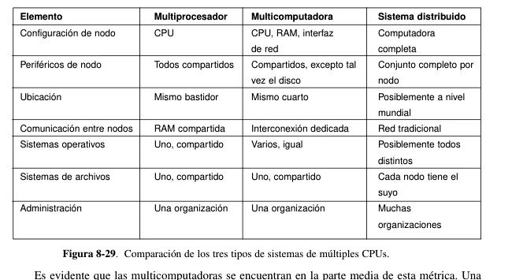

## 7.8 Comparación clave

| Elemento | Multiprocesador | Multicomputadora | Distribuido |
|---|---|---|---|
| Memoria | Compartida | Privada por nodo | Privada por máquina |
| Sistema operativo | Uno compartido | Varios usualmente iguales | Pueden ser distintos |
| Comunicación | RAM/interconexión | Red dedicada | Red tradicional/Internet |
| Administración | Una organización | Una organización | Muchas organizaciones |
| Visión del usuario | Más transparente | Intermedia | Debe ocultar complejidad si es SO distribuido real |

---

# Zona 8 — Preguntas tipo Calidad con respuesta razonada

## 8.1 Pregunta CPU

> Un sistema médico recibe frecuencia cardíaca, oxígeno y presión cada 2 segundos. Además, un proceso de IA calcula riesgo cardiovascular y dispara alarma. ¿Qué política de CPU recomendaría?

### Respuesta

Primero separo procesos. La lectura de sensores es de ráfaga baja pero E/S constante y tiempo real. La IA tiene ráfaga alta porque calcula, clasifica o compara, pero también es crítica porque dispara alarma.

No conviene una política puramente FCFS, porque un proceso largo podría atrasar la alarma. Tampoco basta con SJF si el proceso crítico es pesado, porque SJF podría relegarlo. Recomendaría prioridad o planificación de tiempo real para el proceso de alarma, y Round Robin o prioridad menor para tareas de registro histórico.

La defensa es que el dato médico pierde valor si llega tarde. La eficacia no es solo terminar; es terminar a tiempo.

## 8.2 Pregunta memoria

> Un análisis de imágenes de cultivos necesita cargar imágenes grandes y comparar regiones. La memoria no alcanza para la imagen completa. ¿Qué estrategia de memoria explica mejor el caso?

### Respuesta

El caso pide memoria virtual con paginación o una estrategia de procesamiento por bloques. La imagen se divide en páginas o regiones. En memoria principal mantengo la región activa y el resto queda en disco o intercambio. Si ocurre fallo de página, traigo la región requerida y, si no hay marco libre, saco una víctima.

No debo decir simplemente “más RAM”. La pregunta busca entender el tránsito: disco → memoria principal → intercambio si no cabe → páginas activas según uso.

Si hay localidad, LRU, reloj o conjunto de trabajo pueden ser mejores que FIFO, porque evitan sacar regiones que se están usando repetidamente.

## 8.3 Pregunta archivos

> Un sensor de temperatura y uno de brillo solar alimentan un sistema de potrero. ¿Qué tipo de archivo construye cada uno?

### Respuesta

No clasifico el proceso completo. Cada dispositivo genera su propia data de origen.

El sensor de temperatura genera valores numéricos periódicos. Construye un archivo regular de registros con timestamp y temperatura. Su acceso natural es secuencial para escritura continua, con posible índice por tiempo para consultas.

El sensor de brillo solar genera irradiancia o nivel de luminosidad. También construye registros periódicos. Si se consulta por rangos horarios, conviene acceso indexado por tiempo. Si solo se guarda histórico, secuencial basta.

Si ambos sensores producen más rápido de lo que se escribe, requieren buffer. Cache solo tendría sentido para consultas repetidas sobre rangos históricos, no para el dato fresco.

## 8.4 Pregunta E/S

> Un disco atiende solicitudes A, B y C. Cada archivo está repartido en sectores. ¿Por qué el dispositivo necesita buffer?

### Respuesta

Porque el disco no entrega “el archivo completo” como una unidad mágica. Entrega sectores o bloques. Si el archivo está disperso, el controlador/driver debe ir ubicando partes, colocarlas temporalmente y verificar consistencia. Cuando la solicitud está completa, se entrega al proceso o a memoria principal.

El buffer permite reunir esas partes y desacoplar la velocidad del dispositivo de la velocidad del proceso. No es cache, porque no necesariamente busco reutilizar; busco completar y estabilizar la entrega.

## 8.5 Pregunta bloqueos

> Con E=[4,2,3,1], C y R como en la pizarra, determine si hay interbloqueo.

### Respuesta

Calculo disponibilidad:

```text
C total = [2,1,3,1]
A = E - C total = [4,2,3,1] - [2,1,3,1] = [2,1,0,0]
```

Reviso solicitudes:

```text
P1 pide [2,0,0,1] → no
P2 pide [1,0,1,0] → no
P3 pide [2,1,0,0] → sí
```

P3 puede terminar y libera [0,1,2,0]. Ahora A=[2,2,2,0]. P2 puede terminar y libera [2,0,0,1]. Ahora A=[4,2,2,1]. P1 puede terminar y libera [0,0,1,0]. Ahora A=[4,2,3,1].

Como existe secuencia P3→P2→P1, no hay interbloqueo.

---

# Zona 9 — Chuleta final de decisión

## 9.1 CPU

| Si veo... | pienso... |
|---|---|
| Alarma, salud, actuador | Tiempo real / prioridad |
| Cálculo pesado | Ráfaga alta |
| Sensor frecuente | E/S alta, CPU puede ser baja |
| Muchos usuarios interactivos | Round Robin |
| Quantum demasiado pequeño | Mucho cambio de contexto |
| Proceso largo primero | FCFS puede empeorar espera |

## 9.2 Memoria

| Si veo... | pienso... |
|---|---|
| Bloques iguales | Particiones fijas, desperdicio interno |
| Huecos dispersos | Fragmentación externa |
| 0/1 por unidad | Mapa de bits |
| Estado + dirección + tamaño + puntero | Lista ligada |
| No cabe en RAM | Intercambio / memoria virtual |
| Página ausente | Fallo de página |
| Muchos fallos | Thrashing |
| Dato frecuente | Cache |
| Dato temporal de paso | Buffer |

## 9.3 Archivos

| Si veo... | pienso... |
|---|---|
| Sensor | Registro con timestamp |
| Cámara/audio | Binario o stream |
| Disco | Bloques/sectores |
| Búsqueda por tiempo/id | Índice |
| Solo registrar | Secuencial |
| Leer región específica | Directo |
| Compartido y escrito | Sección crítica/permisos |

## 9.4 Entrada/Salida

| Si veo... | pienso... |
|---|---|
| Mecánica/señal | Dispositivo/controlador |
| Software del SO para dispositivo | Driver/manejador |
| Transferir sin CPU byte a byte | DMA |
| Aviso al terminar | Interrupción |
| Producción más rápida que consumo | Buffer |
| Reutilización frecuente | Cache |
| Error de señal | Corrección/retransmisión |

## 9.5 Bloqueos

| Si veo... | pienso... |
|---|---|
| Recurso exclusivo | Exclusión mutua |
| Tiene uno y pide otro | Contención y espera |
| No se puede quitar | No apropiación |
| Ciclo | Espera circular |
| Un recurso por tipo | Grafo y ciclo bastan |
| Varios recursos por tipo | Matrices E, A, C, R |
| Estado seguro | Hay secuencia de terminación |
| Estado inseguro | Puede caer en bloqueo |

---

# Zona 10 — Estudio activo con Markdown

## 10.1 Tarjetas de memoria

> [!question]- ¿Cuándo uso buffer y no cache?
> Uso buffer cuando el dato llega, se fragmenta, se acumula o espera consumo. No necesito que se reutilice. Ejemplos: sensor, audio, red, disco armando sectores.

> [!question]- ¿Cuándo uso cache y no buffer?
> Uso cache cuando el mismo dato o bloque se consulta muchas veces y quiero evitar acceso caro repetido. Ejemplos: tabla de configuración, bloque de archivo leído por varios procesos, patrón usado por IA.

> [!question]- ¿Qué hace DMA?
> La CPU configura dirección, tamaño y operación; el controlador/DMA transfiere el bloque y luego interrumpe. DMA evita que CPU copie byte por byte.

> [!question]- ¿Qué diferencia hay entre mmap y DMA?
> DMA es transferencia dispositivo-memoria. mmap es ver un archivo dentro del espacio de direcciones del proceso para trabajar por páginas/regiones.

> [!question]- ¿Por qué buddies desperdicia memoria?
> Porque redondea la solicitud al bloque potencia de 2 más pequeño que la contiene. A cambio gana división y fusión ordenada.

## 10.2 Checklist antes de responder un caso

- [ ] Identifiqué el dato crudo, no solo el resultado procesado.
- [ ] Separé CPU-bound de I/O-bound.
- [ ] Dije si hay tiempo real y por qué llegar tarde invalida el resultado.
- [ ] Distinguí buffer de cache.
- [ ] Clasifiqué archivo por dato, estructura, tipo y acceso.
- [ ] Si hablé de memoria, dije si hay fragmentación, swap, páginas, buddies o ajuste.
- [ ] Si hablé de E/S, separé dispositivo, controlador, driver, buffer, DMA e interrupción.
- [ ] Si hablé de bloqueo, probé ciclo, matriz o estado seguro.
- [ ] Si hablé de distribuido, dije si reparto código, datos o ambos.

## 10.3 Tabla final de contraste

| Tema | Pregunta de Calidad | Respuesta corta defendible | Imagen guía |
|---|---|---|---|
| Ajustes | ¿Dónde cabe y qué residuo deja? | First/Next/Best/Worst/Quick cambian recorrido, costo y desperdicio. | ![[assets/pizarra_10_algoritmos_asignacion_memoria.webp]] |
| Buddies | ¿Qué potencia de 2 lo contiene? | Asigno bloque mínimo suficiente y fusiono socios libres. | ![[assets/pizarra_11_buddies_memoria.webp]] |
| E/S | ¿Dónde se verifica y arma el dato? | En buffer del dispositivo/subsistema antes de entregar a memoria del proceso. | ![[assets/pizarra_09_vision_general_so_io_dma_mmap.webp]] |
| DMA | ¿Quién mueve el bloque? | Controlador/DMA, con CPU configurando y recibiendo interrupción final. | ![[assets/pizarra_09_vision_general_so_io_dma_mmap.webp]] |
| mmap | ¿Cargo todo o trabajo por regiones? | Archivo mapeado si conviene tratar porciones como memoria. | ![[assets/pizarra_09_vision_general_so_io_dma_mmap.webp]] |

---

# Apéndice — Imágenes de las pizarras

## Pizarra 1 — Tabla de caracterización


## Pizarra 2 — E/S, disco, señales y buffer


## Pizarra 3 — Bloqueos, grafo y políticas


## Pizarra 4 — Sistemas distribuidos


## Pizarra 5 — Banquero y matrices


## Pizarra 6 — Flynn

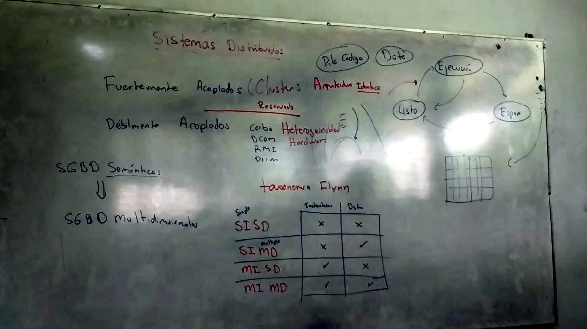

## Pizarra 7 — Banquero y tiempo global

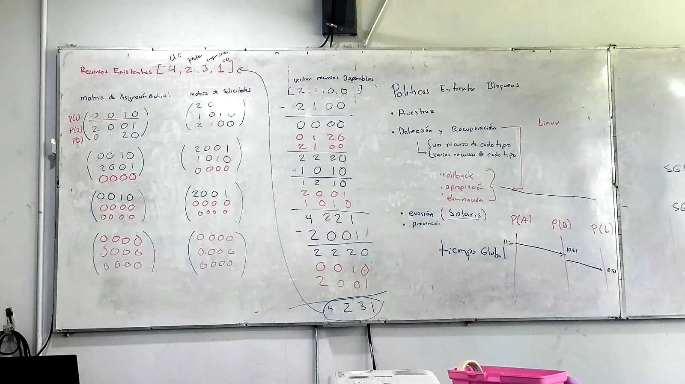

## Pizarra 8 — Distribuidos, vista borrosa

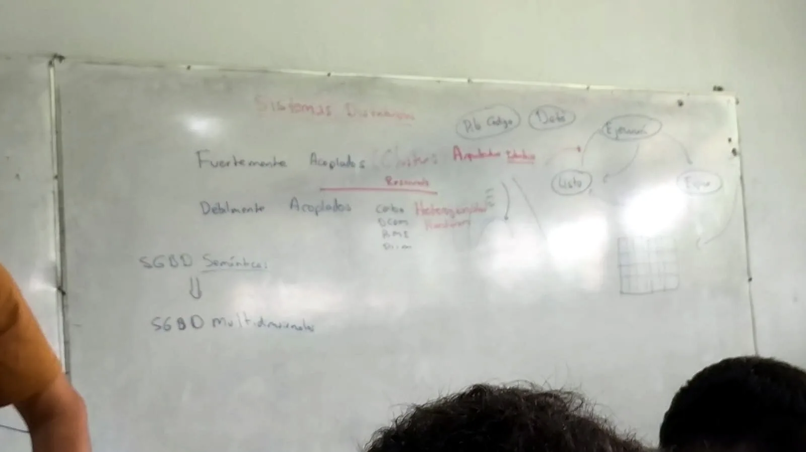

## Pizarra 9 — Visión general SO, E/S, DMA y mmap


## Pizarra 10 — Algoritmos de asignación de memoria


## Pizarra 11 — Buddies / socios de memoria


